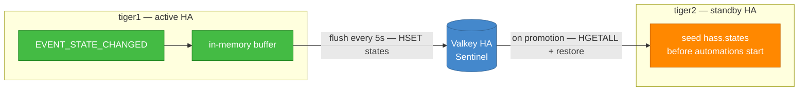

# Cluster State Sync — a shared-state mirror for active-passive Home Assistant

> **Status**: alpha — boots, listens, snapshots, restores, and has survived
> measured failovers on a live two-node cluster. Not yet battle-tested by anyone
> but its author. Built for a 2.5-minute failover budget against a Valkey/Redis
> Sentinel cluster.

> ## ⚠ No warranty — read before installing
>
> **This is alpha software and there are no guarantees that it runs.** It is
> built for Home Assistant, shared with the community for testing and feedback,
> and it requires exactly that: testing, and feedback. **No guarantees are given
> on data integrity or on consistency of functionality at this time.**
>
> **It restores state to devices that act in the physical world.** The default
> mirrored domains include `climate`, `water_heater`, `vacuum` and `timer`, so a
> stale or wrong restore can change your heating setpoint or your hot water —
> not merely a number on a dashboard. `alarm_control_panel`, `person` and
> `device_tracker` are **opt-in and off by default**; turn them on and an
> alarm's state is mirrored too. Decide deliberately what you let it mirror, and
> test a failover before you depend on one.
>
> Provided **as is**, without warranty of any kind, and without liability — see
> [LICENSE](LICENSE). If losing state, or an entity coming back in the wrong
> state, would matter to you, do not run this on a system you rely on until you
> have proven it on one you do not.

## Where to start

Pick the row that matches what you are trying to do. Everything below this table
is reference — you do not need to read the README front to back.

| I want to… | Go to |
|---|---|
| **Install it** | [RUNBOOK-installation.md](docs/RUNBOOK-installation.md) — requirements, which HA install types can run the failover half at all, and the order things must be done in |
| **Use the dashboard** | [GUIDE-dashboard.md](docs/GUIDE-dashboard.md) — every row and button, what the colours mean, and **when not to press each one** |
| **Fix something that is broken** | [TROUBLESHOOTING.md](docs/TROUBLESHOOTING.md) — symptom-first, from real failures on a live cluster |
| **Change the restore, the swap, or the bundle** | 🚨 [GOTCHAS.md](docs/GOTCHAS.md) **first** — 24 traps this project actually fell into, nearly all of which reported success while doing nothing |
| **Understand what it does at runtime** | [REFERENCE-behaviour.md](docs/REFERENCE-behaviour.md) — restore semantics, leadership, sizing, actions |
| **Keep the mobile app working through a failover** | GUIDE-ingress.md — the cluster can promote in 15 seconds and still leave the app dead |
| **Bring a standby up from cold** | [RUNBOOK-standby-bringup.md](docs/RUNBOOK-standby-bringup.md) |
| **Know why it is built this way** | [the ADRs](docs/adr/README.md), with a suggested reading order |
| **Work on the code** | CONTRIBUTING.md |
| **Re-litigate a closed decision** | [DECISIONS-SETTLED.md](docs/DECISIONS-SETTLED.md) — check here first; several of these keep being rediscovered as blockers |
| **See what changed** | v0.3.1 · v0.3.0 |

## What this is

A Home Assistant custom integration that:

1. **Mirrors selected entity states** to a shared Redis/Valkey hash, on a
   configurable interval (default: every 5 seconds).
2. **Restores those states on startup**, before the automation engine begins
   running, so a freshly-promoted standby node doesn't act on stale or empty
   state during the failover window.

It does this entirely through public Home Assistant APIs — no monkey-patching,
no fork of core, no fragility against minor version bumps.

## What this is *not*

This is **not** native Home Assistant clustering. Specifically, it does
**not**:

* Provide automation leader election. Both instances will fire automations
  during the brief overlap window. For most automations this is annoying
  (lights turn on twice); for automations with external side effects
  (notifications, counters, irrigation) it's worth thinking about before
  enabling.
* Solve integration session ownership. Both nodes will try to connect to
  the same Hue bridge, Sonos, Plex, etc. The standby has been doing this
  in any active-passive design anyway.
* Solve cryptographic single-instance integrations (HomeKit bridge identity,
  Matter fabric). Those still need to live on shared storage (NFS) and
  only one node loads them at a time. The `notify_master` / `notify_backup`
  hooks are the right tool for that toggle.
* Replace the recorder. The HA recorder still runs as normal — point both
  nodes at your Patroni HA Postgres if you want the history DB to survive
  failover too.

If you need real clustering, you need the kind of work that would justify
a fork of core. See the conversation history that produced this skeleton.

## Architecture in one diagram



## Failover topology & standby models

The two nodes run **shared-nothing** (independent drives, no NFS) with three replication tiers —
slow config via `rsync`, live entity state via this integration, and history via shared Postgres —
and a **selectable standby posture**:

* **Cold standby** (recommended default) — the standby HA process is stopped until it is
  promoted; simplest and safest with today's code, at the cost of cold-boot RTO.
* **Warm standby** — the standby runs but is neutered (network-gated egress + mDNS block, gated
  flush loop, gated automations), for seconds-level failover.

Leadership is the single source of truth, applied to every gating layer by the `notify_master` /
`notify_backup` scripts on each host. Those began life as Keepalived hooks. They are now run by
`cluster-promoter`, a timer that reads the Valkey lease every ten seconds and invokes them when
leadership actually changes — so there is no VIP, no VRRP, and no second election to disagree with
the first. The setup **wizard** picks the model and generates the host-side bundle. See
**[ADR-001 — Active-passive topology](docs/adr/ADR-001-active-passive-topology.md)** for the full
decision, the Docker firewall recipe, and the trade-offs.

## Installation

**Read [the installation runbook](docs/RUNBOOK-installation.md) first.** It
covers the requirements, the two setup scenarios, and the order things must be
done in. The short version:

1. **Copy `custom_components/cluster_state_sync/` into `config/custom_components/`
   on both instances**, then restart both.
2. **Settings → Devices & Services → Add Integration → Cluster State Sync**, on
   each node.
3. Pick **Sentinel** mode against a Valkey Sentinel cluster, or **Direct** for a
   single host.
4. **Keep the cluster namespace identical across nodes.** Make the node ID
   different on each — the default, the container hostname, does that for you.
5. **Copy the cluster secret from the first node to the second, exactly.** A
   mismatch means neither node will accept the other's state, and the symptom is
   a restore that quietly does nothing.

> **Installation is a file copy, not HACS — for now.** This repository is
> private, and HACS fetches `manifest.json` and `hacs.json` from
> `raw.githubusercontent.com` without authentication, which 404s on a private
> repo. The `hacs.json` here is kept accurate so nothing needs doing on the day
> this goes public; then it installs as a custom repository, category
> *Integration*, on **both** instances.

> The integration lives at `custom_components/cluster_state_sync/` rather than
> the repository root. It used to sit at the top level with a symlink here, and
> that made the repository un-installable through HACS — a symlink does not
> survive being copied out of a repository. Moved 2026-08-26.

## Configuration

| Setting | Default | What it does |
|---|---|---|
| Cluster namespace | `default` | Logical cluster ID — must match across all nodes that should share state. Allows multiple clusters on one Valkey. |
| Node ID | container hostname | Used to attribute state writes; we never restore states this node wrote itself. |
| Snapshot interval | 5s | How often the buffer flushes to Redis. Lower = less data loss on failover, more write pressure. |
| Restore max age | 1800s (30m) | Snapshots older than this are ignored on startup. Stops a node coming back after a week from restoring ancient garbage. |
| Include domains | see `const.py` | Entity domains we mirror. Defaults to `input_*`, `counter`, `timer`, `vacuum`, `climate`, `humidifier`, `water_heater`. **`person`, `device_tracker` and `alarm_control_panel` are opt-in** — see `SENSITIVE_DOMAINS`. Edit `DEFAULT_INCLUDE_DOMAINS` to extend. |
| Entities that prove a radio is receiving | *(empty — off)* | Globs, e.g. `sensor.*_rssi_numeric`. Creates a **Radio silence** sensor: seconds since the freshest of them last changed. See [Diagnostics](#diagnostics). |

## What you get in Home Assistant

Nothing to paste and no entity names to look up: the panel registers itself and
the entities land in an auto-created **Cluster** area.

### The Cluster panel

A **Cluster** item appears in your sidebar after install. It discovers the
entities rather than being told their names, so it works on both nodes without
per-node editing, and it shows both nodes side by side.

**[GUIDE-dashboard.md](docs/GUIDE-dashboard.md) is the manual** — what each row
means, what each button does, when *not* to press it, and what the colours are
saying:

| Colour | Meaning |
|---|---|
| plain | safe — reads state, changes nothing |
| amber | changes how the cluster behaves |
| red | **moves the house to the other machine** |

### Two switches, because both were once files you had to SSH in to touch

| Switch | What it does | Why it exists |
|---|---|---|
| **Maintenance hold** | Suspends automatic failover on this node | Restarting Home Assistant on the leader *is* a full failover. The flag that prevents it lived only in a host script the person pressing **Restart** was not looking at. It has cost this fleet a real outage. |
| **Handover request** | Asks this node to hand leadership to its peer | The supported way to move the house deliberately. It is a *request*: the peer still has to take the lease, so this cannot produce two leaders. |

Both read their state from disk on every update rather than caching it, because
the host scripts write the same files and the two views must never disagree.

There is **no force-promote button**, on purpose — see
[Actions](docs/REFERENCE-behaviour.md#actions).

## Diagnostics

Every way this integration fails is quiet by design, so it exposes its own
health as entities. Backend errors are deliberately swallowed — a Redis outage
must never crash Home Assistant — which makes these the *only* place that
failure becomes visible.

**Replication health**

| Entity | What it tells you |
|---|---|
| **Entities tracked** | How many entities this node is mirroring. Compare against what you expect; this is the number that makes a broken filter obvious. |
| **Last snapshot age** | Seconds since this node's last *successful* write. Climbs and never resets if the flush loop stalls. Reads *unknown*, never zero, if nothing has ever been written. |
| **Shared snapshot age** | Age of what is actually in the store — the peer's writes included. This is what a promotion would restore *from*. |
| **Entities restored** | How many entities the last restore actually seeded. **A promotion that restored zero is the failure this integration exists to prevent.** |
| **Backend** | Connectivity to Valkey/Redis, polled every 60s. |

**Cluster shape**

| Entity | What it tells you |
|---|---|
| **Is leader** | Whether this node currently holds the lease. |
| **Cluster leader** | Which node does — by name, from the store, so both nodes agree or visibly do not. |
| **Cluster members** | How many nodes have checked in recently. |
| **Clock skew** | The spread between members' clocks. The restore's max-age window is meaningless once this is large, so it warns well before that cliff. |
| **Maintenance hold** | Whether failover is currently suspended here. |

**Go-bag (config replication)**

| Entity | What it tells you |
|---|---|
| **Fileset age** | How stale the replicated config is. |
| **Fileset degraded** | The go-bag was stale or missing at promotion. It marks degraded and **never blocks the promotion** (D4) — a standby with old config still beats no standby. |
| **Unreplicated config references** | Files your `configuration.yaml` includes that would *not* cross to the peer. This exists because a promoted node once came up in recovery mode behind a promotion that reported success at every step. |

**Radios**

| Entity | What it tells you |
|---|---|
| **Radio silence** | Seconds since anything you called a radio was last heard from. Off until you configure the globs. |

🚨 **Read the `status` attribute, not only the value.** It has three states, and
two of them read `unknown`:

| `status` | means |
|---|---|
| `ok` | at least one radio has reported — the number is real |
| `no_matches` | the globs match nothing — a configuration problem |
| `no_reports` | entities matched, none has ever reported — **the radio is deaf** |

`no_reports` is the loudest condition the sensor can find and it is deliberately
not a large number, because "never" has no age. On this fleet an alert
thresholded on the value alone would have sat quietly through **thirty hours**
of completely deaf RFXtrx receivers.

🚨 **Watch one radio's signals per list.** The sensor reports the *freshest*
match, which is right within a radio and wrong across radios: a Wi-Fi RSSI
sensor reporting every 60 seconds will hold the number near zero through a
completely dead Zigbee or RF radio. Watching more entities looks safer and is
the exact opposite.

It also reads near-zero for the first few minutes after a Home Assistant
restart — Home Assistant writes every entity's state as it starts, so a low
value there says nothing about whether a packet has actually arrived. Set any
alert threshold longer than your instance's boot time.

Radio silence is the answer to a gap the failover design does not close and
still will not: Home Assistant can be perfectly healthy while every radio behind
it is dead. On this fleet a Zigbee daemon livelocked — 78% CPU, no output for 32
minutes, its healthcheck reporting `healthy` — and the whole house lost Zigbee
with every signal the cluster watches staying green.

It **does not trigger failover**. Promoting because a radio died would move the
house onto a node whose radios may be no better. And it does not pick your
threshold: only you know your own traffic, and a quiet house at 4am legitimately
produces no RF for a long while. What is diagnostic is a number that *used* to
move and has stopped. Full treatment in
[GOTCHAS §18](docs/GOTCHAS.md#18-a-docker-healthcheck-says-healthy-while-the-process-is-livelocked).

### Alerting — install the blueprint

Exposing the sensors is only half the job. Every way this integration fails is
quiet by design: the backend goes away and the flush loop just stops, the peer
stops writing and the snapshot ages, a promotion restores nothing at all and
logs one line about it. Nothing in the house changes, so nobody looks.

A blueprint ships with the repository to close that:

[](https://my.home-assistant.io/redirect/blueprint_import/?blueprint_url=https%3A%2F%2Fgithub.com%2Fboywiz%2Fha-cluster-state-sync%2Fblob%2Fmain%2Fblueprints%2Fautomation%2Fcluster_state_sync%2Ffailover_readiness.yaml)

Or **Settings → Automations & scenes → Blueprints → Import blueprint** and paste:

```
https://github.com/boywiz/ha-cluster-state-sync/blob/main/blueprints/automation/cluster_state_sync/failover_readiness.yaml
```

It watches three things, because they fail differently:

| Trigger | What it means |
|---|---|
| **Backend unreachable** (past a grace period) | Nothing is being written. A promotion now restores whatever was last saved, or nothing. |
| **Snapshot age above a limit** | The backend is *up* and the flush loop stopped anyway — the harder failure to spot, and the one the Backend sensor cannot see. |
| **Restored zero entities** | This node promoted cold. Nothing came across from the peer. |

That third one is the reason the blueprint exists rather than a line in the
docs saying "alert on snapshot age". Restoring nothing was a real defect for the
entire life of this project, it was found by running the thing rather than by
testing it, and its only symptom was an INFO line nobody read. Install the
alerting with the thing it alerts on.

You supply the notification action, so it can be a phone push, a persistent
notification, or a light — whatever you will actually notice. Only the three
entities and that action are required; the thresholds have defaults.

## Security

The v1 adversarial review rated this integration's original security posture
**P0** — not because of one flaw, but because four of them combined: location
and alarm state mirrored by default, in plaintext, into a shared keyspace
protected by one password, then applied verbatim on restore with no integrity
check. Each leg is addressed below.

### Cluster secret (required)

Every snapshot entry is signed with HMAC-SHA256 keyed by a per-cluster secret,
and verified on restore. The signature covers the state, the attributes, both
timestamps, the schema version, the writing node **and the entity ID** — so an
entry cannot be edited, cannot claim to come from the peer, and cannot be
replayed onto a different entity.

* The setup form pre-fills a fresh 256-bit secret. **Copy that exact value to
  the other node.** A mismatch means neither node accepts the other's state.
* **With no secret configured, this node refuses to restore anything.** It will
  still publish its own state. Starting cold is a worse failover; obeying a
  forged alarm state is a worse outcome.

### TLS

Off by default, because turning it on silently would break every deployment
whose Valkey has no TLS listener. Turn it on. Certificate verification is
always required when TLS is enabled — there is deliberately no "insecure TLS"
toggle, since TLS without verification just encrypts your traffic to whoever
is on the path.

### Sensitive domains are opt-in

`person`, `device_tracker` and `alarm_control_panel` are **no longer mirrored
by default**. They are exactly the states you most want a promoted standby to
know, and also exactly the states that tell a reader of the shared hash when
the house is empty and unarmed. Add them to `include_domains` deliberately, and
pair them with TLS — the integration logs a warning at startup if you track
them without it.

### Give it its own Redis user

The namespace is an organisational label, **not** a security boundary: anything
holding the credential can read every namespace, and `db=2` is not isolation
either. Provision a dedicated ACL user scoped to this integration's keys:

```
ACL SETUSER ha-cluster-sync on >CHANGE-ME \
    ~ha:cluster_state_sync:* \
    +@read +@write +@keyspace -@dangerous
```

That user can read and write the integration's own keys and nothing else — so a
leaked credential does not become the run of your Valkey.

### What is *not* protected

* **The password and cluster secret are stored in plaintext.** Home Assistant
  writes config entries to `.storage/` as unencrypted JSON. The setup form masks
  those fields, which stops shoulder-surfing and nothing more. Anyone who can
  read your `config/` directory has both. Restrict its permissions, and treat a
  host compromise as a compromise of the cluster secret.

  **And read that in the light of what a cluster does to `config/`.** If you
  replicate it to the standby — which the tier-1 model in ADR-001 does, and
  which is how a cold standby comes up with your dashboards intact — then both
  secrets now exist on two hosts. So **treat them as present on every node**,
  and give the integration its own Valkey ACL user, which is the mitigation that
  actually bounds a leak.

  Home Assistant's own backups are a separate question with a better answer:
  they are **encrypted**, so a backup on its own does not give up the cluster
  secret. But the passphrase has to be stored for unattended backups to work, and
  it lives in `.storage/backup` — beside the thing it encrypts. So the rule is to
  keep backups and `.storage` in *different places*: any destination that holds
  both has the ciphertext and the key.
  Full treatment in the security architecture, §3.1.
* **Leader election.** Both nodes still run automations during the overlap
  window. See the known limitations.
* **Tombstones.** A deleted entity lingers in the shared hash until overwritten.

## Setup wizard & the host bundle

The config flow is a five-step wizard (ADR-001 §4). Steps 4 and 5 only appear
for the warm model:

1. **Backend** — Direct or Sentinel, plus TLS and the cluster secret.
2. **Standby model** — Cold (recommended) or Warm, plus the leadership signal,
   the peer host, and the Home Assistant container name.
3. *(warm only)* **Network gating** — IoT subnet CIDRs, whether to block
   mDNS/SSDP, Docker network mode, the uid HA runs as, container IP, and the
   promotion settle delay.
4. **Generate** — writes the host bundle and shows you what it produced.

The bundle lands in `<config>/cluster_state_sync_bundle/` and contains the
`notify_master` / `notify_backup` / `notify_fault` scripts, the `cluster-promoter`
timer, service and wrapper that drive them, the go-bag pull and swap scripts, and
— for warm — the firewall rulesets plus a safety script. Copy it to
`/etc/cluster-sync/` on **both** hosts and read `INSTALL.md` first.

Regenerating prunes what it no longer produces, so an install still carrying an
older bundle loses its `keepalived-cluster.conf` and rsync units the next time you
write one. That is deliberate. A Keepalived config sitting beside the promoter is
an invitation to install both and end up with two elections racing each other.

Regenerating prunes artifacts that no longer apply, so switching warm → cold
does not leave orphaned firewall rules behind claiming to be live.

> ### The firewall rules are generated blind
>
> They are written from your wizard answers without any access to the machines
> they target, and every generated ruleset says so in its own header. The hosts
> run other services, and a wrong ruleset can cut them off or lock you out of
> SSH.
>
> The bundle ships `nft-safety-revert.sh` for exactly this. Arm it, load the
> ruleset, confirm you still have a shell, *then* cancel:
>
> ```bash
> ./nft-safety-revert.sh arm 120
> nft -f follower-host.nft
> ./nft-safety-revert.sh cancel     # only if you're still alive
> ```
>
> Then check the counters actually move — a ruleset that loads cleanly and
> matches nothing is the failure mode to watch for, because it looks like it
> worked.

If you don't know your Docker network mode, pick "Not sure" and all three
variants are generated; the notify scripts then call a dispatcher with a single
`NETWORK_MODE=` setting for you to fill in once, rather than guessing.

## Known limitations

* Two HA instances both running automations will double-fire during the
  failover window. Mitigated by short failover but not eliminated.
* No tombstoning of deleted entities — they'll linger in the snapshot
  until overwritten or until you bump the namespace.
* Each flush writes the full tracked map rather than a delta. Fine for
  hundreds of entities; would need rethinking at tens of thousands.
* HomeKit/Matter cryptographic identity is out of scope.

## Settled decisions

Several design questions are closed and keep getting rediscovered. Before raising one as a
blocker, check **[DECISIONS-SETTLED.md](docs/DECISIONS-SETTLED.md)** — it covers the standby
rebuild, Sentinel, the Valkey placement, the cold-standby default and secret storage.

## Design documentation

| Document | Covers |
|---|---|
| [ADR index](docs/adr/README.md) | All seven architecture decisions, with a suggested reading order |
| [ADR-001 — Active-passive topology](docs/adr/ADR-001-active-passive-topology.md) | Cold vs warm standby, the four gating layers, three replication tiers |
| [ADR-002 — Snapshot integrity](docs/adr/ADR-002-snapshot-integrity.md) | Why entries are signed, what is signed, and why no secret means no restore |
| [ADR-003 — Leadership resolution](docs/adr/ADR-003-leadership-resolution.md) | The three signals, the atomic lease, and failing closed |
| [ADR-004 — Snapshot write semantics](docs/adr/ADR-004-snapshot-write-semantics.md) | Full map, merge not replace, and the tombstone trade |
| [ADR-005 — Generate, don't control](docs/adr/ADR-005-generate-not-control.md) | Why the integration emits host config instead of applying it |
| [ADR-006 — Lease promoter](docs/adr/ADR-006-lease-promoter.md) | Why Keepalived went, and why one election beats two |
| [ADR-007 — Operator surface](docs/adr/ADR-007-operator-surface.md) | The panel, the switches, and what is deliberately not a button |

The adversarial review that drove most of this
is kept in the repo, along with the closure record
for all 35 findings.

## Removing it

Removing the integration does **not** remove what it generated on the host, and
nothing else will tell you that.

1. **Delete the config entry** — Settings → Devices & Services → Cluster State
   Sync → the three-dot menu → Delete. This stops the mirroring and removes the
   entities and the device.
2. **Delete the integration folder** — `config/custom_components/cluster_state_sync/`
   — then restart Home Assistant.
3. **Stop and remove the host units**, on **both** nodes, if you installed the
   bundle:
   ```bash
   sudo systemctl disable --now cluster-promoter.timer cluster-fileset-pull.timer
   sudo rm -f /etc/systemd/system/cluster-promoter.{service,timer}
   sudo rm -f /etc/systemd/system/cluster-fileset-pull.{service,timer}
   sudo systemctl daemon-reload
   sudo rm -rf /etc/cluster-sync /run/cluster-sync
   ```
   🚨 **Leave the promoter running and you keep a timer taking a lease and
   restarting Home Assistant on leadership changes, with nothing left to explain
   why.** This is the step people forget.
4. **Check the firewall**, for a warm-standby install. If a follower ruleset was
   loaded, the node is still gated: `sudo nft list ruleset`. The bundle ships
   `nft-safety-revert.sh` for exactly this.
5. **Optionally clear the shared store** — the snapshot and go-bag outlive the
   integration:
   ```bash
   redis-cli ... --scan --pattern 'ha:cluster_state_sync:<namespace>:*' | xargs redis-cli ... DEL
   ```

## Licence

Copyright © 2026 Maurice Manning.

**GNU Affero General Public License v3.0.** See [LICENSE](LICENSE) for the full
text. Distributed **WITHOUT ANY WARRANTY** — see sections 15 and 16, and the
warning at the top of this file.

> **What it asks of you, in plain terms.** Run it at home, modify it, take it
> apart — the licence asks nothing at all. The obligations begin only when
> *other people* use your version: distribute a modified copy, or let others
> interact with one over a network (§13), and you must offer them your changes
> under the same licence.
>
> That network clause is the difference between the AGPL and the ordinary GPL,
> and it is the point: improvements to something people *run* rather than ship
> should come back.

> **Note on upstreaming.** This section previously read "Apache 2.0 — same as
> Home Assistant core, so an upstream PR remains straightforward." That is no
> longer true and the trade was made deliberately: Home Assistant core is
> Apache-2.0, and AGPL code cannot be merged into it. This integration is a
> custom component and stays one.
