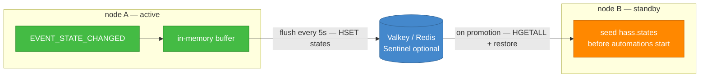

# Cluster State Sync

Active-passive failover for Home Assistant. It mirrors entity state and
configuration into a shared Valkey or Redis, and restores them on the standby at
startup, before the automation engine runs, so a freshly promoted node does not
act on empty or stale state.

Measured on real hardware: a standby fully initialised in **~102 seconds** after
host loss. That number covers losing the whole machine, and the promoted node had
no radios attached. Home Assistant failing on its own is slower on purpose.

> ## ⚠ Alpha — read this before installing
>
> No guarantees are given on data integrity or on consistency of functionality.
>
> **It restores state to devices that act in the physical world.** The default
> mirrored domains include `climate`, `water_heater` and `timer`, so a stale or
> wrong restore can change your heating setpoint or your hot water, not merely a
> number on a dashboard. `alarm_control_panel`, `person` and `device_tracker`
> are opt-in and off by default.
>
> Provided as is, without warranty of any kind — see [LICENSE](LICENSE). If an
> entity coming back in the wrong state would matter to you, prove it on a
> system you do not rely on before you depend on it.

## In one minute, without jargon

You run Home Assistant. If the machine it runs on dies, your house stops
responding until you fix it — and when you do bring a second machine up, it
knows nothing: no login, no history of what was on or off, none of your setup.

This puts a **second machine on standby**. Both talk to a small shared
noticeboard. The active one keeps writing what everything is doing; the standby
keeps a copy of your logins and settings. If the active one dies, the standby
notices within about half a minute and takes over — **working again in about a
hundred seconds**, with your accounts, your integrations and your last known states
already in place.

**What it does not do**, plainly:

- It is **not** a backup. Take backups as well.
- It does **not** make Home Assistant itself more reliable — it makes *losing a
  machine* survivable.
- While both are briefly up, **both run your automations**, so anything that
  sends a message or costs money can happen twice.
- **Radios can follow, over USB-over-IP.** Two of the three on the machine this
  was built for move on promotion. A stick plugged *directly* into a machine
  cannot — that is a plug, not software. Which of those you have decides a lot,
  so read **[the radio guide](docs/GUIDE-radios.md)** before you buy anything.

**Is this for you?** If you have never run Home Assistant, no — get comfortable
with it first; this replicates whatever you have, including your mistakes. If
you run it in Docker on a machine you can get a root shell on, and losing it for
an evening would genuinely bother you, then yes.

> **New to any of this?** Every term used anywhere in these docs is defined in
> **[the glossary](docs/GLOSSARY.md)** — no prior Home Assistant, Docker or
> clustering knowledge assumed. If a word is missing from it, that is a bug in
> the docs.

## Will this work for me?

- **Two Home Assistant instances**, and a Valkey or Redis on something that is
  neither of them. If the store lives on a node, losing that node loses the
  thing the other one needs.
- **Container or Core installs.** Home Assistant OS cannot run the failover half
  yet; see the roadmap.
- **Home Assistant 2026.6.4 or newer.** Every release from there to 2026.9.2 has
  been verified with a full suite run — 2026.6.4, 2026.7.4, 2026.8.3, 2026.9.2 —
  rather than only the oldest and newest.
- **Your radios decide a lot.** On USB-over-IP (VirtualHere, `usbip`) they move
  with the lease. Plugged straight into a machine, they cannot. Read
  [GUIDE-radios.md](docs/GUIDE-radios.md) before buying hardware.

[RUNBOOK-installation.md](docs/RUNBOOK-installation.md) has the full
requirements and the order things have to be done in.

## What decides who is in charge

The Valkey instance is the arbitration point — the same job a quorum witness
does in a classic failover cluster. Leadership is an **atomic lease** held in
it: taking it is a single Lua script, so two nodes cannot both hold it, and a
node that does not hold it does not write. That is why the store must not live
on either Home Assistant machine.

## Why not Proxmox HA, or Kubernetes?

If you already run hypervisor-level HA and a few minutes of downtime is
acceptable, use it. It is simpler than this and you should not add a second
thing.

This exists for the cases that does not cover:

- **It restarts a VM; it does not keep a warm one.** That is a cold boot, in
  minutes, from whatever was last on disk.
- **It cannot see inside.** A machine that is up while Home Assistant is wedged
  looks healthy to the hypervisor.
- **It does not move USB devices.**

It is also not free of split-brain: losing contact between nodes and having the
original come back has produced two live instances for people. The lease here is
the answer to that specific problem — one holder, or none.

## Install

Through HACS as a **custom repository**, category *Integration*, on **both**
instances. It is deliberately not in the HACS default store, and only released
versions are offered.

Then work through [the worked example](docs/EXAMPLE-two-node-install.md), which
goes from two machines and a Valkey to a failover you have actually proven.

## Documentation

| I want to… | Go to |
|---|---|
| Read the full list of what it cannot do | [KNOWN-LIMITATIONS.md](docs/KNOWN-LIMITATIONS.md) |
| Understand the security posture | [REFERENCE-security.md](docs/REFERENCE-security.md) |
| Understand a word I don't know | [GLOSSARY.md](docs/GLOSSARY.md) |
| Install it | [RUNBOOK-installation.md](docs/RUNBOOK-installation.md) |
| See one whole install, start to finish | [EXAMPLE-two-node-install.md](docs/EXAMPLE-two-node-install.md) |
| Work out whether my radios can fail over | [GUIDE-radios.md](docs/GUIDE-radios.md) |
| Choose what to replicate | [GUIDE-choosing-domains.md](docs/GUIDE-choosing-domains.md) |
| Reach it after it moves | [GUIDE-ingress.md](docs/GUIDE-ingress.md) |
| Patch, reboot and monitor the two machines | [GUIDE-infrastructure.md](docs/GUIDE-infrastructure.md) |
| Use the dashboard | [GUIDE-dashboard.md](docs/GUIDE-dashboard.md) |
| Fix something broken | [TROUBLESHOOTING.md](docs/TROUBLESHOOTING.md) |
| Understand what it does at runtime | [REFERENCE-behaviour.md](docs/REFERENCE-behaviour.md) |
| Know why it is built this way | [the ADRs](docs/adr/README.md) |
| See what changed | [CHANGELOG.md](CHANGELOG.md) |
| Contribute | [CONTRIBUTING.md](CONTRIBUTING.md) |

## Licence

**GNU Affero General Public License v3.0** (AGPL-3.0). See [LICENSE](LICENSE)
for the full text.
