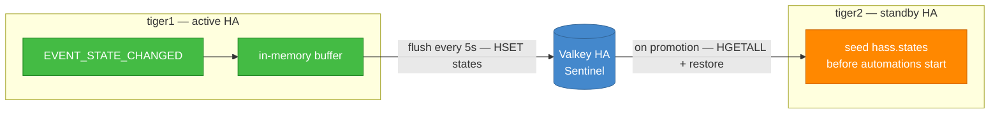

# Cluster State Sync — a shared-state mirror for active-passive Home Assistant

> **Status**: alpha skeleton — boots, listens, snapshots, restores. Not yet battle-tested.
> Built for a 2.5-minute failover budget against a Valkey/Redis Sentinel cluster.

## What this is

A Home Assistant custom integration that:

1. **Mirrors selected entity states** to a shared Redis/Valkey hash, on a
   configurable interval (default: every 5 seconds).
2. **Restores those states on startup**, before the automation engine begins
   running, so a freshly-promoted standby node doesn't act on stale or empty
   state during the failover window.

It does this entirely through public Home Assistant APIs — no monkey-patching,
no fork of core, no fragility against minor version bumps.

## What this is *not*

This is **not** native Home Assistant clustering. Specifically, it does
**not**:

* Provide automation leader election. Both instances will fire automations
  during the brief overlap window. For most automations this is annoying
  (lights turn on twice); for automations with external side effects
  (notifications, counters, irrigation) it's worth thinking about before
  enabling.
* Solve integration session ownership. Both nodes will try to connect to
  the same Hue bridge, Sonos, Plex, etc. The standby has been doing this
  in any active-passive design anyway.
* Solve cryptographic single-instance integrations (HomeKit bridge identity,
  Matter fabric). Those still need to live on shared storage (NFS) and
  only one node loads them at a time. The `notify_master` / `notify_backup`
  hooks are the right tool for that toggle.
* Replace the recorder. The HA recorder still runs as normal — point both
  nodes at your Patroni HA Postgres if you want the history DB to survive
  failover too.

If you need real clustering, you need the kind of work that would justify
a fork of core. See the conversation history that produced this skeleton.

## Architecture in one diagram



## Failover topology & standby models

The two nodes run **shared-nothing** (independent drives, no NFS) with three replication tiers —
slow config via `rsync`, live entity state via this integration, and history via shared Postgres —
and a **selectable standby posture**:

* **Cold standby** (recommended default) — the standby HA process is stopped until it is
  promoted; simplest and safest with today's code, at the cost of cold-boot RTO.
* **Warm standby** — the standby runs but is neutered (network-gated egress + mDNS block, gated
  flush loop, gated automations), for seconds-level failover.

Leadership is the single source of truth, applied to every gating layer by the `notify_master` /
`notify_backup` scripts on each host. Those began life as Keepalived hooks. They are now run by
`cluster-promoter`, a timer that reads the Valkey lease every ten seconds and invokes them when
leadership actually changes — so there is no VIP, no VRRP, and no second election to disagree with
the first. A built-in setup **wizard** (planned) picks the model and generates the host-side
bundle. See
**[ADR-001 — Active-passive topology](../../docs/adr/ADR-001-active-passive-topology.md)** for the full
decision, the Docker firewall recipe, and the trade-offs.

## Installation

1. Drop the `cluster_state_sync/` directory into your `config/custom_components/`
   on **both** HA instances.
2. Restart both instances.
3. **Settings → Devices & Services → Add Integration → Cluster State Sync**
4. Pick **Sentinel** mode if you're using the Manning Madness Valkey cluster,
   or **Direct** for a single host.
5. Keep the cluster namespace identical across nodes. Make the node ID
   different on each (the default — container hostname — does this for you).

## Configuration

| Setting | Default | What it does |
|---|---|---|
| Cluster namespace | `default` | Logical cluster ID — must match across all nodes that should share state. Allows multiple clusters on one Valkey. |
| Node ID | container hostname | Used to attribute state writes; we never restore states this node wrote itself. |
| Snapshot interval | 5s | How often the buffer flushes to Redis. Lower = less data loss on failover, more write pressure. |
| Restore max age | 1800s (30m) | Snapshots older than this are ignored on startup. Stops a node coming back after a week from restoring ancient garbage. |
| Include domains | see `const.py` | Entity domains we mirror. Defaults to stateful things like `input_*`, `alarm_control_panel`, `person`. Edit `DEFAULT_INCLUDE_DOMAINS` to extend. |

## Sizing & performance

* Each state takes roughly 200–500 bytes serialised.
* A typical home with 200 tracked entities → ~80KB snapshot.
* Write cost: one Redis `HSET` + `SET` per flush, and the flush is skipped
  entirely when nothing changed since the last one. Even on a Pi with a few
  hundred entities, this is sub-10ms.
* There is deliberately **no** `DEL` before the `HSET`. The write merges, so
  two nodes flushing concurrently cannot erase each other's entries — the
  interim guard until leader election lands.
* Read cost (restore): one `HGETALL` + `GET`. Single round-trip.

## What gets restored, what doesn't

On startup, after backend connection but before the automation engine
starts, the integration:

1. Reads the full snapshot.
2. Refuses the whole thing if it holds more entries than the cap — a
   legitimate snapshot is hundreds of entries, not thousands.
3. For each entity, checks: is it in our include filter? Was the snapshot
   written by *another* node? Is its timestamp readable, and not stamped
   implausibly far in the future? Is it within the max-age window? Are its
   attributes within the size budget? Is it newer than the local state?
4. If yes to all, calls `hass.states.async_set()` to seed it — with a single
   shared context, so the whole restore is one identifiable operation rather
   than a scatter of unattributable state changes.

A bad entry costs that entry and nothing else: an unreadable timestamp, an
oversized payload or a corrupt stored value is logged and skipped, never
allowed to abort the restore and leave the node cold.

**Restore only happens at startup.** If you add the integration to an
already-running Home Assistant, it deliberately does *not* restore — seeding
dozens of entities into a live system would fire every automation watching
them. The snapshot is applied on the next restart instead.

Integrations that have already restored their own state via `RestoreEntity`
take priority — we only fill gaps and refresh stale values.

## Security

The v1 adversarial review rated this integration's original security posture
**P0** — not because of one flaw, but because four of them combined: location
and alarm state mirrored by default, in plaintext, into a shared keyspace
protected by one password, then applied verbatim on restore with no integrity
check. Each leg is addressed below.

### Cluster secret (required)

Every snapshot entry is signed with HMAC-SHA256 keyed by a per-cluster secret,
and verified on restore. The signature covers the state, the attributes, both
timestamps, the schema version, the writing node **and the entity ID** — so an
entry cannot be edited, cannot claim to come from the peer, and cannot be
replayed onto a different entity.

* The setup form pre-fills a fresh 256-bit secret. **Copy that exact value to
  the other node.** A mismatch means neither node accepts the other's state.
* **With no secret configured, this node refuses to restore anything.** It will
  still publish its own state. Starting cold is a worse failover; obeying a
  forged alarm state is a worse outcome.

### TLS

Off by default, because turning it on silently would break every deployment
whose Valkey has no TLS listener. Turn it on. Certificate verification is
always required when TLS is enabled — there is deliberately no "insecure TLS"
toggle, since TLS without verification just encrypts your traffic to whoever
is on the path.

### Sensitive domains are opt-in

`person`, `device_tracker` and `alarm_control_panel` are **no longer mirrored
by default**. They are exactly the states you most want a promoted standby to
know, and also exactly the states that tell a reader of the shared hash when
the house is empty and unarmed. Add them to `include_domains` deliberately, and
pair them with TLS — the integration logs a warning at startup if you track
them without it.

### Give it its own Redis user

The namespace is an organisational label, **not** a security boundary: anything
holding the credential can read every namespace, and `db=2` is not isolation
either. Provision a dedicated ACL user scoped to this integration's keys:

```
ACL SETUSER ha-cluster-sync on >CHANGE-ME \
    ~ha:cluster_state_sync:* \
    +@read +@write +@keyspace -@dangerous
```

That user can read and write the integration's own keys and nothing else — so a
leaked credential does not become the run of your Valkey.

### What is *not* protected

* **The password and cluster secret are stored in plaintext.** Home Assistant
  writes config entries to `.storage/` as unencrypted JSON. The setup form masks
  those fields, which stops shoulder-surfing and nothing more. Anyone who can
  read your `config/` directory has both. Restrict its permissions, and treat a
  host compromise as a compromise of the cluster secret.
* **Leader election.** Both nodes still run automations during the overlap
  window. See the known limitations.
* **Tombstones.** A deleted entity lingers in the shared hash until overwritten.

## Setup wizard & the host bundle

The config flow is a five-step wizard (ADR-001 §4). Steps 4 and 5 only appear
for the warm model:

1. **Backend** — Direct or Sentinel, plus TLS and the cluster secret.
2. **Standby model** — Cold (recommended) or Warm, plus the leadership signal,
   the peer host, and the Home Assistant container name.
3. *(warm only)* **Network gating** — IoT subnet CIDRs, whether to block
   mDNS/SSDP, Docker network mode, the uid HA runs as, container IP, and the
   promotion settle delay.
4. **Generate** — writes the host bundle and shows you what it produced.

The bundle lands in `<config>/cluster_state_sync_bundle/` and contains the
`notify_master` / `notify_backup` / `notify_fault` scripts, the `cluster-promoter`
timer, service and wrapper that drive them, the go-bag pull and swap scripts, and
— for warm — the firewall rulesets plus a safety script. Copy it to
`/etc/cluster-sync/` on **both** hosts and read `INSTALL.md` first.

Regenerating prunes what it no longer produces, so an install still carrying an
older bundle loses its `keepalived-cluster.conf` and rsync units the next time you
write one. That is deliberate. A Keepalived config sitting beside the promoter is
an invitation to install both and end up with two elections racing each other.

Regenerating prunes artifacts that no longer apply, so switching warm → cold
does not leave orphaned firewall rules behind claiming to be live.

> ### The firewall rules are generated blind
>
> They are written from your wizard answers without any access to the machines
> they target, and every generated ruleset says so in its own header. The hosts
> run other services, and a wrong ruleset can cut them off or lock you out of
> SSH.
>
> The bundle ships `nft-safety-revert.sh` for exactly this. Arm it, load the
> ruleset, confirm you still have a shell, *then* cancel:
>
> ```bash
> ./nft-safety-revert.sh arm 120
> nft -f follower-host.nft
> ./nft-safety-revert.sh cancel     # only if you're still alive
> ```
>
> Then check the counters actually move — a ruleset that loads cleanly and
> matches nothing is the failure mode to watch for, because it looks like it
> worked.

If you don't know your Docker network mode, pick "Not sure" and all three
variants are generated; the notify scripts then call a dispatcher with a single
`NETWORK_MODE=` setting for you to fill in once, rather than guessing.

## Leadership — who writes

Only the leader writes to the shared snapshot. Choose the signal at setup:

| Signal | Use when | How it works |
|---|---|---|
| **Always leader** (default) | Single node, or a **cold standby** whose Home Assistant is stopped until promotion | This node always writes. The pre-v0.2 behaviour. |
| **Follow an entity** | **Warm standby**, or an external promoter you already trust | Point it at an `input_boolean` your `notify_master` / `notify_backup` scripts toggle. |
| **Valkey lease** | Warm standby, strongest option | The node takes a TTL lease in Valkey itself, renewed on every flush. |

The lease is the **split-brain guard** ADR-001 depends on, and since the promoter
replaced Keepalived it is the election as well. Take-or-renew is evaluated
atomically inside Valkey rather than as a read-then-write race, so two nodes
asking at the same instant get different answers. A heartbeat on the wire cannot
promise that: under a partition both halves can reasonably conclude they are the
survivor.

Every path **fails closed**. A missing entity, a typo'd entity ID, an
unreachable backend — all resolve to *follower*. Assuming leadership when you
cannot establish it is exactly how you end up with two leaders.

On a clean shutdown the leader hands its lease back, so the standby promotes
immediately instead of waiting out the TTL.

> This gates layer 2 of ADR-001's four. Layer 1 (nftables), layer 3 (recorder)
> and layer 4 (automations) are host-side or not yet implemented — see
> [ADR-001](../../docs/adr/ADR-001-active-passive-topology.md).

## Diagnostics

The integration exposes four diagnostic entities on its own device, so a
degraded sync is visible instead of silent:

| Entity | What it tells you |
|---|---|
| **Entities tracked** | How many entities this node is mirroring. Compare against what you expect — this is the number that makes a broken snapshot obvious. |
| **Last snapshot age** | Seconds since the last *successful* write. Climbs and never resets if the flush loop stalls or the backend is unreachable. Reads *unknown*, never zero, if nothing has ever been written. |
| **Entities restored** | How many entities the last restore actually seeded. A promotion that restored zero is the failure this integration exists to prevent. |
| **Backend** | Connectivity to Valkey/Redis, polled every 60s. |

Backend errors are deliberately swallowed so a Redis outage can never crash
Home Assistant — which means these entities are the only place that failure
becomes visible. Alert on **Last snapshot age**.

## What's intentionally left for v0.2+

* **Leader election** via Sentinel-backed lease. Once that lands, the
  flush loop will only run on the leader, eliminating dual-writer races.
* **Automation gating** — a `cluster.exec_if_leader` service that
  automation blueprints can wrap their actions in.
* **Postgres backend** for users who already have Patroni and don't want
  to introduce Redis just for this.
* **A better liveness signal.** The promoter asks Home Assistant's own HTTP API
  whether it is answering before renewing the lease, which catches a wedged
  event loop that a process check would miss. It still says nothing about
  partial degradation — an instance returning 500 to every request looks alive.
* **Tombstones** so deleted entities propagate.

## Upstream-PR path

The maintainers have been clear (see the 2022 WTH thread on HA clustering)
that they're not going to merge a full clustering subsystem. They have
shown willingness to merge *focused* extensibility points.

The realistic upstream contribution from this integration is a small core
PR adding a `state_snapshot_backend` hook to the `restore_state` helper —
something like `async_get_last_state` but pluggable to remote backends.
This integration then ships as the reference consumer. Drafting that PR
is a v0.3 task once the integration has been running in anger for a
month or two.

## Development notes

* **Single-threaded asyncio.** Everything runs on the HA event loop. Any
  blocking call (filesystem, sync DB, sync HTTP) must be wrapped in
  `hass.async_add_executor_job`.
* **Backend failures must never raise.** HA being briefly without state
  sync is a degradation; HA crashing because Redis is down is unacceptable.
  Every backend call is in a try/except that logs and returns a failure
  value.
* **State is immutable in HA.** `hass.states.get()` returns a frozen
  snapshot; mutations happen via `async_set`. Don't try to be clever.
* **Don't listen to events that don't matter.** `EVENT_STATE_CHANGED` is
  the only firehose worth tapping, and it is the only bus subscription the
  integration makes. What gets mirrored is decided by `_should_track`, not by
  any event filter. (Earlier versions of this note described a
  `NOISY_EVENTS_TO_IGNORE` set as the active filter; no such filtering ever
  existed — only `EVENT_STATE_CHANGED` is subscribed, so those events never
  reached a callback in the first place. The constant has been deleted.)

## Known limitations

* Two HA instances both running automations will double-fire during the
  failover window. Mitigated by short failover but not eliminated.
* No tombstoning of deleted entities — they'll linger in the snapshot
  until overwritten or until you bump the namespace.
* Each flush writes the full tracked map rather than a delta. Fine for
  hundreds of entities; would need rethinking at tens of thousands.
* HomeKit/Matter cryptographic identity is out of scope.

## Design documentation

| Document | Covers |
|---|---|
| [ADR index](../../docs/adr/README.md) | All five architecture decisions, with a suggested reading order |
| [ADR-001 — Active-passive topology](../../docs/adr/ADR-001-active-passive-topology.md) | Cold vs warm standby, the four gating layers, three replication tiers |
| [ADR-002 — Snapshot integrity](../../docs/adr/ADR-002-snapshot-integrity.md) | Why entries are signed, what is signed, and why no secret means no restore |
| [ADR-003 — Leadership resolution](../../docs/adr/ADR-003-leadership-resolution.md) | The three signals, the atomic lease, and failing closed |
| [ADR-004 — Snapshot write semantics](../../docs/adr/ADR-004-snapshot-write-semantics.md) | Full map, merge not replace, and the tombstone trade |
| [ADR-005 — Generate, don't control](../../docs/adr/ADR-005-generate-not-control.md) | Why the integration emits host config instead of applying it |

The adversarial review that drove most of this
is kept in the repo, along with the closure record
for all 35 findings.

## License

Apache 2.0 — same as Home Assistant core, so an upstream PR remains
straightforward.
