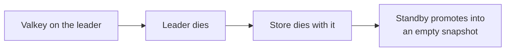
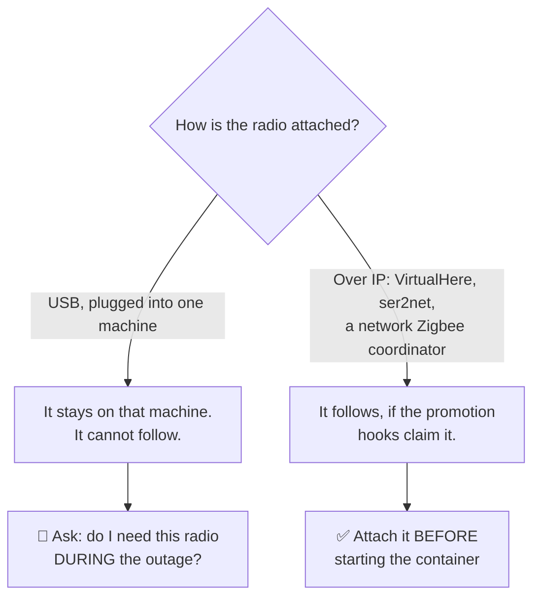
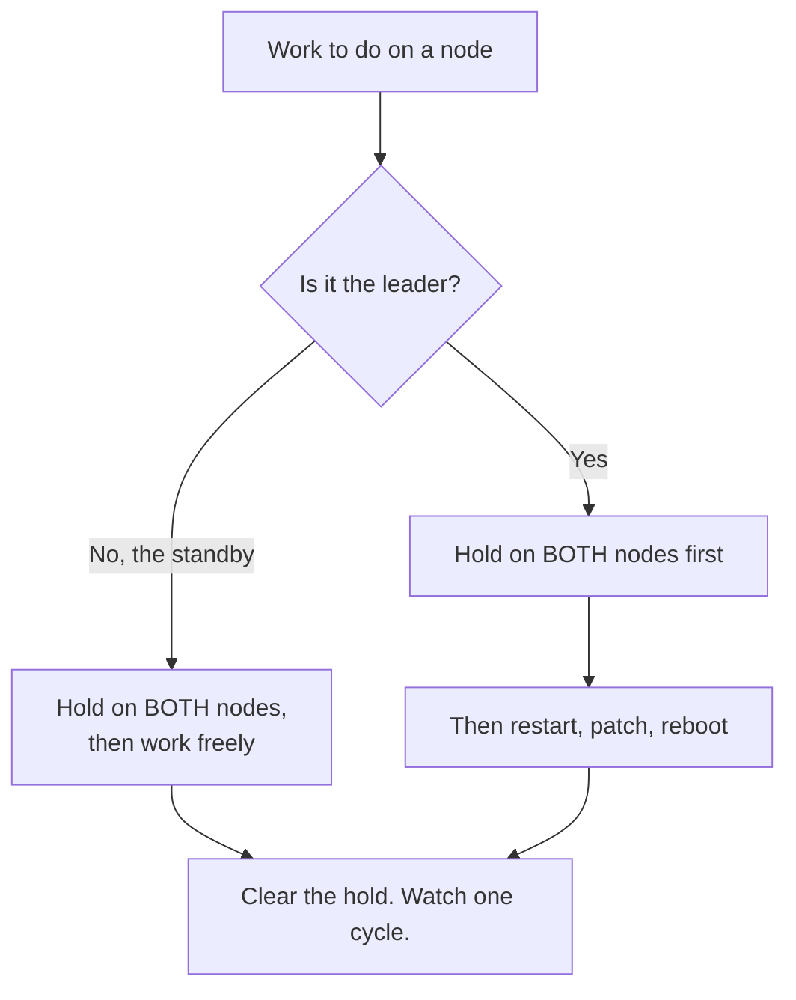
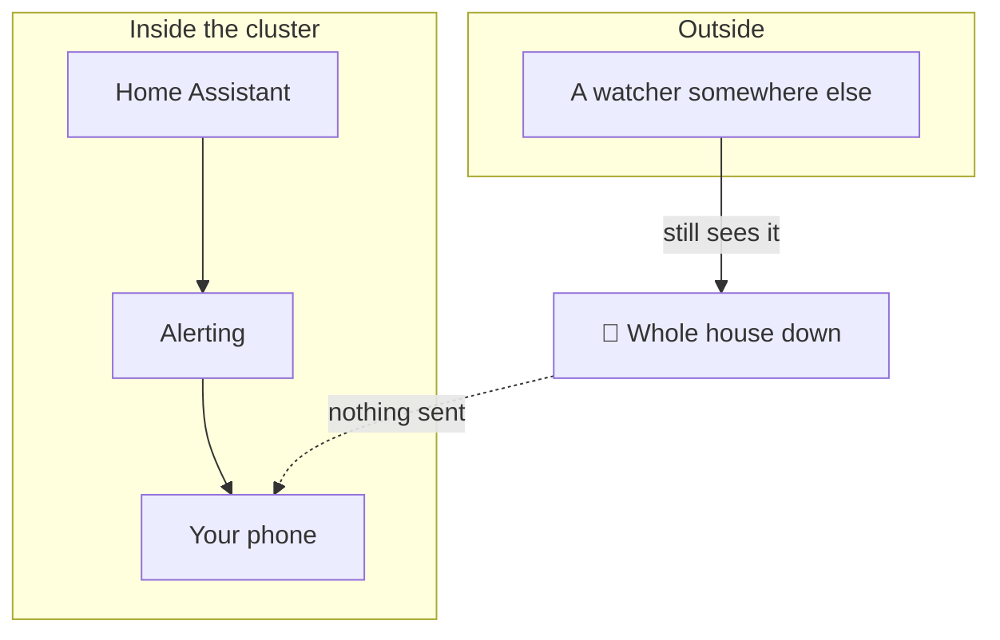

# Running the two machines underneath

**The cluster keeps Home Assistant running. It does not run your hardware, your
updates, or your network.** This guide is about that half — the parts you own,
on a pair where one machine has to keep serving while you work on the other.

> [!IMPORTANT]
> **This is additional information to help you complete your setup, and no
> warranty is provided against it.** Everything below describes *your*
> machines. People build these differently — bare metal, VMs, Proxmox, Docker,
> Podman, different distributions on different schedules — and we cannot be
> responsible for, or test against, an infrastructure we cannot see.
>
> What this integration guarantees is a Home Assistant that keeps running your
> lights, your automations and your alarms across a failover. Keeping the
> machines under it patched and reachable is a systems-administration problem,
> and it is yours.
>
> We would rather write this down and be honest about its limits than leave you
> to discover the gap during an outage.

Every section is written three times: **Level 1** if you have one machine and a
standby you rarely touch, **Level 2** if you run both deliberately, **Level 3**
if you have a fleet and a change process. Read your level. The levels are about
*your* situation, not your ability.

---

## The one thing to understand

Failover is not a substitute for maintenance. It is what buys you the time to
do maintenance safely.

A cluster that has never been patched fails over perfectly into a machine with
the same three-year-old kernel and the same unfixed bug. The point of a second
node is that **you can take one down on purpose**, on a Tuesday, in daylight,
with a coffee — instead of at 3am because it fell over on its own.

If reading this leaves you with one habit, make it that one.

---

## Where the shared store lives

Decided elsewhere, deliberately. Valkey placement is answered by the decision
helper in **[GUIDE-ingress.md](GUIDE-ingress.md)**, because the same question —
*what still works when this machine is gone?* — settles both.

The short version, so this page is not useless on its own:



**Do not put the shared store on either node.** A third machine, or a pair with
its own failover. If you only have two machines, the store belongs on whichever
is *least* likely to be the one you lose — and you should know which that is.

---

## Radios: which follow, and which never will

The cluster moves Home Assistant. Whether your radios follow depends entirely
on how they are attached, and this is the section people skip and then regret.



### Level 1 — one machine has the radios

That is fine, and it is where nearly everyone starts. Be honest about what it
means: a promotion gives you Home Assistant without your Zigbee, Z-Wave or
433 MHz devices. Your history, your helpers and your cloud integrations come
back. Your lights do not.

For many houses that is still worth having. **Write down which devices go
quiet**, so that during an outage you are not rediscovering it.

### Level 2 — radios reachable over IP

Put the radios on the network rather than in a machine — a USB-over-IP server
(VirtualHere), a serial-over-IP bridge (ser2net), or a coordinator that is
natively networked. Then a promotion can claim them.

Two rules, both learned the hard way:

> [!WARNING]
> **Attach the devices BEFORE starting the container, always.**
>
> A container's `/dev` is a **snapshot taken when it starts**. A device that
> appears on the host afterwards is invisible inside the container until it is
> restarted. On this project's reference pair, starting Home Assistant three
> and a half minutes before the radios were claimed cost five hours of a dead
> Zigbee network — and nothing reported a fault, because from inside the
> container there was simply no device to miss.
>
> This is why the promotion hooks are `pre-start.d/`.

> [!WARNING]
> **Release must be unconditional, and it is the demotion that does it.**
>
> Stopping Home Assistant on the leader does *not* release its radios — the
> USB-over-IP client holds them, and it is the promoter's demotion hook that
> lets go. If you stop Home Assistant expecting the radios to move, they will
> not, and you will conclude the handover has failed when it has not started.

### Level 3 — and the radio that never moves

There is usually one. A transceiver wired directly to a specific machine
because it drives something that machine owns.

🚨 **Ask the question nobody asks: would you need that radio *during* the
outage this cluster exists to survive?**

On this project's reference pair the answer was yes, and it was found by
accident. A 433 MHz transceiver hardwired to the primary is the transmitter a
firewall recovery watchdog uses. Failing over silently removes the last-resort
path for recovering the network you would need in order to fix anything —
while every health check stays green, because nothing is broken. It is simply
somewhere else.

Write down the radios that cannot follow, next to what depends on them. If any
of them is part of how you *recover*, that is a single point of failure the
cluster cannot see and will never report.

---

## Updates, pinning and maintenance reboots

The reason to have two machines. Also the thing most likely to take both down
if you do it carelessly.



### The maintenance hold, which you will not know exists

Most people find this the hard way, so it goes first.

**Restarting Home Assistant on the leader, without a hold, causes a failover.**
The peer sees the lease lapse and promotes. You get a real, unplanned
switchover in the middle of a routine restart — and on a cold standby that
means a second Home Assistant starting up while you thought you were doing
something small.

```bash
# On BOTH nodes, before any planned work:
/etc/cluster-sync/cluster-hold.sh on "patching the standby"

# ... do the work ...

/etc/cluster-sync/cluster-hold.sh off      # on both, and check you did
```

The hold is per-node and both matter: it stops a held node taking a free lease
as well as giving one away. There is also a **Maintenance hold** switch on the
Cluster panel, which does the same thing for the node you are looking at.

> [!CAUTION]
> **Clear it afterwards.** A node left on hold will not fail over. Nothing
> looks wrong, the cluster reports healthy, and you find out when the failover
> you were relying on does not happen. Set a reminder if your work will span a
> break.

### Level 1 — one node you touch, one you do not

Patch the standby whenever you like: nobody is using it. Then patch the leader
under a hold, in daylight, and watch one full cycle afterwards before you walk
away.

Order that works and needs no thought:

1. Hold on **both** nodes.
2. Update the standby. Reboot it if the kernel changed.
3. Wait for it to come back and its promoter timer to be active again.
4. Update the leader. Reboot it if needed.
5. Clear the hold on both.
6. Watch one promoter cycle. Confirm one node is leader and the other is not.

### Level 2 — you deliberately run both

Now the interesting question is **what you pin**, because a pair whose halves
drift apart is a pair that fails over into something subtly different.

| Thing | Pin it? | Why |
|---|---|---|
| Home Assistant container tag | **Yes, to an exact version** | `stable` on two machines means two versions the day one of them restarts |
| This integration | Yes | Both nodes must agree on the on-the-wire format |
| Valkey / Redis | Yes | It is the thing both nodes talk to |
| Base OS packages | No, but patch on a schedule | Drift here matters far less than the three above |

**Update the standby first, always.** It is the node whose failure costs you
nothing, and it is the only free test you will get of the version you are about
to put on the leader.

### Level 3 — a fleet, a change window, and a reboot policy

Kernel updates need a reboot and a reboot is a failover unless you hold. On a
fleet, that means the cluster pair needs to be **excluded from whatever reboots
your other machines automatically**, or handled by a runbook that sets the hold
first. An unattended-upgrades reboot on the leader at 04:00 is an unplanned
failover you will read about in the morning.

Three things worth automating, in this order:

1. **A check that the hold is clear.** The failure mode of this whole procedure
   is a hold left on, and it is silent.
2. **A check that both nodes run the same versions** of the four pinned things
   above.
3. **An alert if a promoter timer is not active.** A stopped promoter is a node
   that cannot promote, and nothing else notices.

---

## Monitoring that is not the cluster itself

Since v0.4.2 the integration can reach you: a promotion, a recovery, Valkey
becoming unreachable, a promotion that restored nothing, and a degraded
configuration all push to any `notify.` service you choose. Turn it on — it
is the *Alerts* page under the integration's **Configure**.

Then understand what it cannot do.



🚨 **Alerting cannot be more available than the thing it runs on.** These
notifications come from Home Assistant, on a node that is up. If the house is
down, nothing is sent — and silence looks exactly like everything being fine.
Worse, *"Valkey unreachable"* is reported by the component that needs Valkey.

### Level 1 — the free version

Turn on the integration's own alerts and pick your phone. That covers the
failures where something is still running to tell you.

Then add **one** thing from outside: a free uptime checker hitting your
external hostname every few minutes. It costs nothing and it catches the case
the cluster cannot report — the one where nothing reports anything.

### Level 2 — watch from a third machine

If you already run something that watches machines — Uptime Kuma, a Pi with a
cron job, your router — point it at three things:

| Watch | Because |
|---|---|
| The external hostname, end to end | Proves ingress, not just the process |
| Each node's promoter heartbeat | A stopped promoter is a node that cannot promote |
| Valkey itself | The one dependency both nodes share |

The middle one is the one people miss. Home Assistant can be perfectly healthy
on a node whose promoter died, and that node will never take over.

### Level 3 — treat the cluster as one service with two members

Alert on the **invariants**, not the parts:

- Exactly one node holds the lease. Zero is an outage; two is a split brain.
- Both promoter heartbeats present.
- The shared snapshot's age is under your restore window.
- Both nodes agree on which entity domains replicate — they should be
  identical, and the Cluster panel says so if they are not.

> [!TIP]
> Watch from somewhere that is **not** on the same power, the same switch or
> the same hypervisor as either node. A monitor that dies with the thing it
> monitors has told you nothing, and it will do it quietly.

---

## Prove it

None of this is real until you have done it once on purpose.

**The maintenance drill**, which is the cheap one and the one you will actually
use:

1. Set the hold on both nodes.
2. Restart Home Assistant on the **leader**.
3. Confirm the peer did **not** promote — that is the whole point of the hold.
4. Clear the hold on both.
5. Confirm the cluster still reports one leader and one follower.

**The failover drill**, which you should do at least once and after any change
to the restore path:

1. Note what your radios currently do, and which will not follow.
2. Hand over deliberately — the **Hand over to peer** switch on the panel.
3. Watch the peer promote and Home Assistant start there.
4. Check the alert reached your phone.
5. **Check a replicated helper actually crossed** — not that the promotion
   happened, but that a value you set on the old leader is present on the new
   one. A promotion that restores nothing looks identical to one that works.
6. Fail back. Confirm the radios return.

Step 5 is the one that matters and the one everybody skips. On this project's
reference pair, promotion worked flawlessly for months while restoring
**nothing at all** — and every health check was green throughout.
