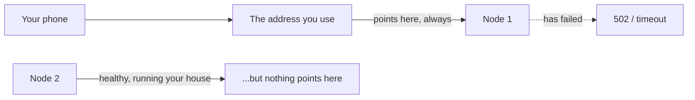
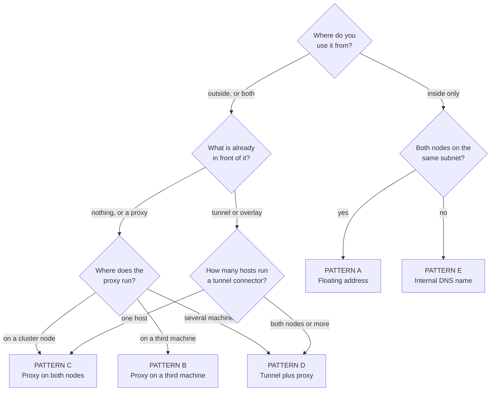
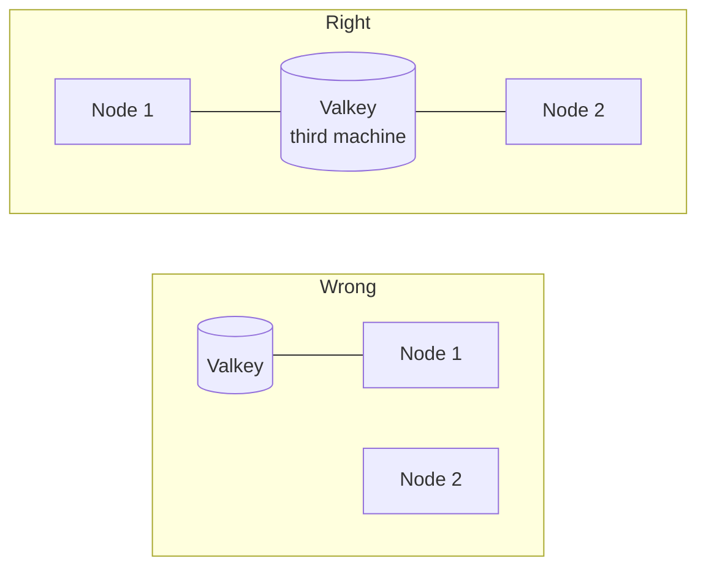
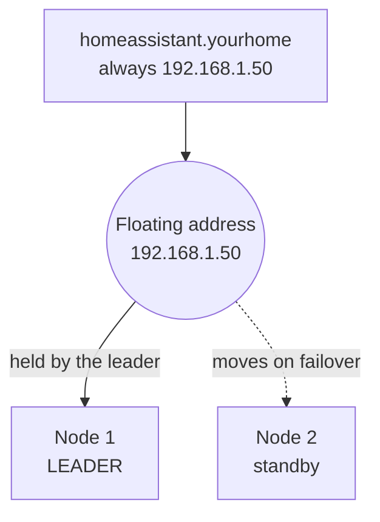
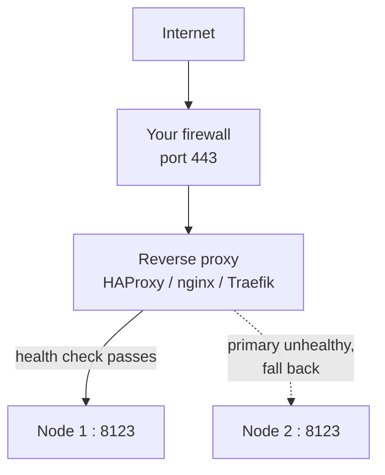
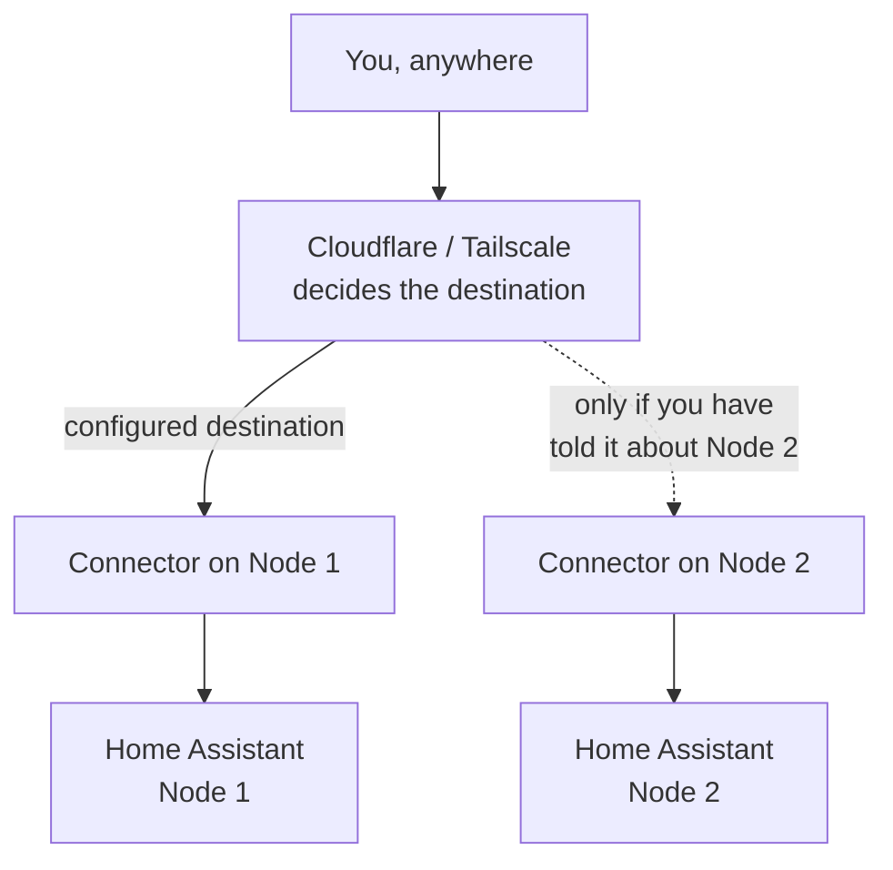
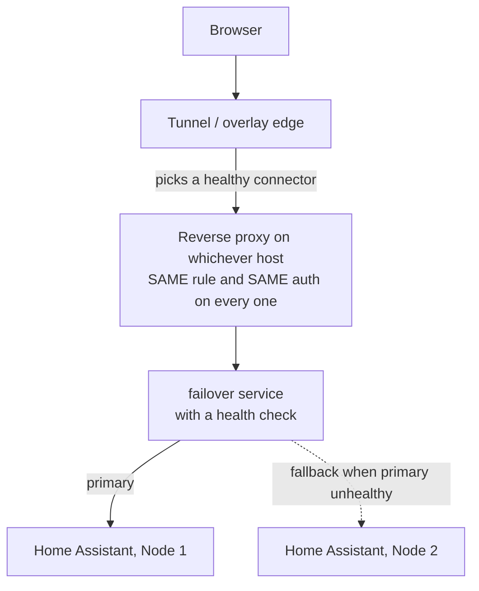
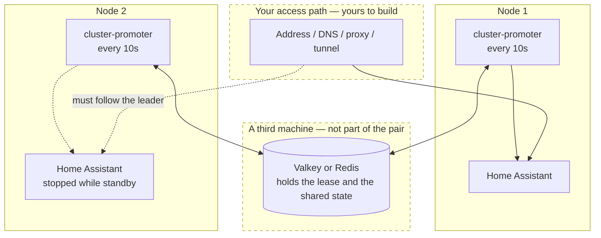
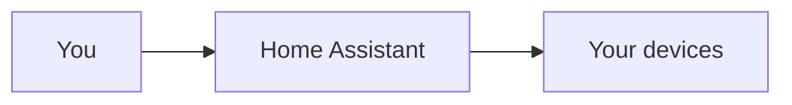

# Getting to Home Assistant after it moves

**The cluster moves Home Assistant between two machines. It does not move your
way in.** This guide is about that half.

> [!IMPORTANT]
> **This is additional information to help you complete your setup, and no
> warranty is provided against it.** Everything below describes *your* network,
> not this integration. People build these differently — firewalls, tunnels,
> VPNs, reverse proxies, VLANs — and we cannot be responsible for, or test
> against, an infrastructure we cannot see. What this integration guarantees is
> a Home Assistant that keeps running your lights, your automations, your
> alarms. Reaching it from a phone on the far side of a firewall is a network
> problem, and it is yours.
>
> We would rather write this down and be honest about its limits than leave you
> to discover the gap during an outage.

---

## The one thing to understand

If you take nothing else from this page:

**Your cluster can fail over perfectly and still leave you locked out.**

Every check the cluster performs can pass — the lease moved, the container
started, the radios followed, the house responds to its own automations — while
the address you type into your phone still points at the machine that died.
The house is fine. You just cannot see it.

That is not a bug in the failover. It is a gap between two systems that do not
know about each other, and closing it is a decision only you can make, because
it depends entirely on how you reach your own home.



---

---

# Work out which answer is yours

Six questions. They start from **what you already run**, because the best
answer is nearly always "use the thing you already have" rather than "build
something new".

Each outcome names a recommendation, says what it costs, says what it does
**not** protect against, and ends with a drill to prove it — because a design
that has not been tested during a real failover is a design, not a defence.

## The questions

**Q1 — Where do you use Home Assistant from?**

| answer | go to |
|---|---|
| Only inside my home network | **Q2**, then read **Pattern A** |
| Only from outside | **Q3** |
| Both | **Q3** — and you will need **two** answers. See *External and internal* below |

**Q2 — Are both nodes on the same network segment?**
Same subnet, no router between them. If you are unsure: can each node `ping`
the other's address without traffic leaving your switch?

| answer | |
|---|---|
| Yes | **Pattern A** works |
| No | **Pattern E** — an internal DNS name is your route |

**Q3 — What is already in front of Home Assistant?**

| answer | go to |
|---|---|
| Nothing — I forward a port, or type an IP | **Q4** |
| A reverse proxy (Traefik, nginx, HAProxy, Caddy) | **Q4** |
| A tunnel or overlay (Cloudflare Tunnel, Tailscale) | **Q5** |
| Both a tunnel and a proxy | **Q5**, then **Pattern D** |

**Q4 — Where does that proxy run — or where would you put one?**

| answer | |
|---|---|
| On one of the two cluster nodes | ⚠️ It dies with that node. **Pattern C** or **Pattern D** |
| On a third machine | **Pattern B** — and that machine is now a single point of failure |
| On several machines already | **Pattern D** |

**Q5 — How many machines run a tunnel connector?**

| answer | |
|---|---|
| One | ⚠️ Your tunnel does not survive losing that machine. **Pattern C** |
| Both cluster nodes, or more | **Pattern C**, or **Pattern D** if you also have a proxy |

**Q6 — Is there a login in front of Home Assistant that is not Home Assistant's own?**
SSO, Authentik, Authelia, Cloudflare Access, basic auth.

| answer | |
|---|---|
| No | Skip it |
| Yes | 🔴 **Read *every path must agree on authentication*.** This is the trap that bites hardest, and it bit a careful fleet this week |

## The same thing as a picture



## The patterns

### Pattern A — a floating address

**Use when:** you only need access from inside, and both nodes share a subnet.

**What it is:** one spare address, held by whichever node holds the lease,
claimed and released by the promoter's hooks. DNS points at it permanently.

**Recommended here** because it is the only option with no third machine and no
extra software: the thing that already decides who leads also carries the
address, so there is nothing to disagree with.

**What it costs:** a spare address that is *provably* free — silence to `ping`
is not proof, because a decommissioned host is silent too. Check your own
inventory. It must also sit outside every Docker network's address pool, or a
container will claim it and the service fails with `address already in use`.

**Does NOT protect:** anything arriving from outside your network.

> [!WARNING]
> **This integration does not yet give you the right moment to claim it.**
> The promoter offers two hook points — `pre-start.d/` (before the container
> starts) and `post-stop.d/` (after it stops). Releasing an address fits
> `post-stop.d/` perfectly. **Claiming one does not fit either**, because the
> rule above says claim *after* Home Assistant answers, and there is no
> post-start moment. Found 2026-09-09 by trying to write the example; tracked
> as AR-0064.
>
> Two things you can do today:
>
> * **Claim in `pre-start.d/` and accept a short window.** The address arrives
>   before Home Assistant is answering, so for roughly its boot time — about
>   25 seconds on the reference fleet — the address is up and returns errors.
>   For a home network that is usually fine. For anything health-checking the
>   address, it is not: the check sees a live host and stops looking.
> * **Do not use a hook at all.** The promoter writes the current role to
>   `/run/cluster-sync/vrrp-state`. A small systemd unit of your own can watch
>   that file and manage the address independently — claiming only once Home
>   Assistant answers, and releasing whenever the file stops saying `MASTER`.
>   This is more code but it is the shape that actually satisfies both rules,
>   and it does not wait on us.

### Pattern B — a health-checking proxy on a third machine

**Use when:** you come in from outside through your own firewall, and you have
a machine that is not one of the two nodes.

**What it is:** the proxy watches both nodes and sends traffic to whichever
answers. In Traefik this is a `failover` service with a `healthCheck`; in
HAProxy a backend with two servers and `check`; in nginx an upstream with
`max_fails`.

**Recommended here** because it needs no address juggling and no cooperation
from the cluster at all.

**What it costs:** that third machine becomes a single point of failure for
reaching the house. Ask yourself what happens when *it* is the one that dies.

**Does NOT protect:** losing the proxy machine. Nor inside-the-house access, if
your LAN resolves the name to a node rather than the proxy.

### Pattern C — a proxy on both nodes

**Use when:** the proxy runs on the cluster nodes themselves, or your tunnel
has a connector on only one machine.

**What it is:** the same rule, with the same failover service and the **same
authentication**, on both nodes. Whichever node is reached can serve, or divert
to its peer.

**Recommended here** because it removes the third-machine dependency of Pattern
B while needing nothing new.

**What it costs:** the rule now exists twice, and two copies can drift. That is
not hypothetical — see the authentication warning below.

**Does NOT protect:** the case where the address people use points at a node
that is fully dead. Something still has to send them to the survivor: a
floating address, an overlay, or DNS.

### Pattern D — a tunnel for hosts, a proxy for the service

**Use when:** you already run a tunnel or overlay with connectors on more than
one machine.

**What it is:** two layers, each doing what it is good at — the tunnel picks a
healthy *host*, the proxy on that host picks a healthy *Home Assistant*.

**Recommended where it is available**, because both layers usually already
exist and neither needs to know about the other. No floating address, no spare
IP, no hook ordering.

**What it costs:** the rule must be on **every** host a connector can land on,
carrying identical authentication and identical carve-outs. Miss one and
behaviour depends on which connector the edge picked.

**Does NOT protect:** inside-the-house access. This is the pattern's real gap
and it surprises people — see *External and internal*.

### Pattern E — an internal DNS name

**Use when:** the nodes are on different segments, so no address can float.

**What it is:** a short-TTL record updated on promotion by a hook.

**Not recommended unless you must**, and for one specific reason: if your DNS
server runs on a cluster node, the survivor must update a record whose primary
has just died. Check where DNS actually runs before choosing this.

**What it costs:** DNS caches. Clients may hold the old answer for minutes.

**Does NOT protect:** anything, quickly. Treat it as a last resort.

## And decide where the shared store lives

Not ingress, but the same shape of question, and easy to get wrong in the same
way: **Valkey (or Redis) must not live on either cluster node.**

It holds the lease. If it runs on node 1 and node 1 dies, the survivor cannot
take a lease that no longer exists — the cluster fails at exactly the moment it
was built for. Put it on a third machine, or on something already designed to
survive: a NAS, a router capable of containers, a small always-on box.



If you genuinely have only two machines, say so out loud in your own notes:
you have a cluster that survives Home Assistant failing but not the machine
hosting the lease.

---

## Level 1 — I just want it to work at home

**If you only ever open Home Assistant on your home Wi-Fi**, you need one
thing: an address that follows the service.

The simplest answer is a **floating address** (sometimes called a VIP — a
virtual IP). One extra address on your network, held by whichever node is
currently the leader. Your phone, your bookmarks and your DNS all point at that
address, permanently, and never change again.



**Why this and not "just update DNS when it moves":** DNS has a cache. Your
phone, your router and your laptop may all keep the old answer for minutes or
hours. Worse, if your DNS server runs on the machine that just died, the
survivor has to update a record on a dead host. A floating address has no such
circularity — it moves in seconds and depends on nothing.

**What you need:** both nodes on the same network segment (the same subnet, no
router between them), and one spare address that nothing else will ever claim.

**What we give you:** the hooks. The promoter runs your scripts on promotion
and demotion; `examples/hardware-custody/` shows the pattern with USB radios,
and the same shape claims and releases an address.

**Two rules if you build this**, both learned the hard way:

1. **Claim the address *after* Home Assistant answers — not before.** This is
   the opposite of the radios, and the reason matters. Radios must be attached
   before the container starts, because a container's `/dev` is a snapshot
   taken at start. An address must not: one that arrives while Home Assistant
   is still booting **accepts connections and returns 502**, which is worse
   than no address at all, because a health check sees a live host and stops
   looking elsewhere.
2. **Release must be unconditional.** If a node that is demoting keeps the
   address, both machines answer to it and your traffic is decided by whichever
   ARP entry a client happens to hold. The release must run even when the rest
   of the demotion has failed.

---

## Level 2 — I reach it from outside, through my own firewall

Now there is a second hop, and the failure can hide in either.



**A health-checking reverse proxy is the right tool here**, and you may already
have one. It watches both nodes and sends traffic to whichever answers.

Two things people get wrong:

- **Use failover, not round-robin.** In this cluster the standby's Home
  Assistant is *stopped* on purpose. A load balancer sharing traffic between
  both would send half of every request into a closed port.
- **Health-check Home Assistant, not the machine.** A node can be perfectly
  alive with its Home Assistant stopped — that is the *normal* state of a cold
  standby. Ping proves nothing; check that something answers on 8123.

**The trade-off worth thinking about:** this puts your firewall in the path of
your home automation. If your firewall is also what you would use to *recover*
from a problem, you have coupled two things you may want independent. That is
not an argument against it — it is an argument for knowing you did it.

---

## Level 3 — Cloudflare Tunnel, Tailscale, or another overlay

These change the picture more than people expect, because **the tunnel decides
where traffic goes, and the tunnel is not part of your cluster.**



**Cloudflare Tunnel.** Run a connector on **both** nodes, and point the tunnel
at an address that follows the leader — or at a reverse proxy that
health-checks both. A connector on only the primary means the tunnel keeps
delivering to a machine that is no longer serving. If your tunnel is
token-based, its routing lives in Cloudflare's dashboard, not in a file on your
host, so it cannot be scripted from here and must be changed there.

**Tailscale.** The same shape. Either put the floating address on the
tailnet, or run Tailscale on both nodes and use a name that resolves to
whichever is up. Tailscale's own failover primitives are worth reading before
inventing one.

**The rule for all of them:** the overlay must be told about *both* nodes, or
pointed at something that already knows which one is live.

---

## Two layers, each doing what it is good at

The strongest arrangement seen in practice separates **losing a host** from
**Home Assistant being down**, and gives each to the thing that handles it well:



| layer | handles | how |
|---|---|---|
| Tunnel / overlay | **a host** being lost | connector selection across several machines |
| Reverse proxy | **Home Assistant** being down | health-checked primary and fallback |

The appeal is that neither layer needs to know about the other, and neither
needs a floating address. If you already run a tunnel with connectors on more
than one machine, you may already have the first layer and not be using it.

### 🔴 If you do this, every path must agree on authentication

This is the trap, and it is a security one rather than an availability one.

If the same hostname is served by a rule on several hosts, **and those rules do
not carry the same authentication**, then which one you get decides whether you
were asked to log in. Seen in the wild on an otherwise careful fleet: one host
put Home Assistant behind SSO, another served the same hostname and the same
backend with no auth at all. Nobody chose that. Nothing reported it. Whichever
connector the edge happened to pick decided it, request by request.

**Check every path to the same hostname carries the same middleware, and
re-check it whenever you add a host.** A path that is only *sometimes* behind
your SSO is not behind your SSO.

Watch the carve-outs too. `/api/webhook` and similar usually must stay
unauthenticated or webhooks and voice assistants break — so the rule is not
"authenticate everything", it is "**every copy of the rule makes the same
exceptions**".

### And turn the access log on before you need it

An ingress you cannot reconstruct after the fact is one you will argue about.
On the fleet this guide draws from, a proxy's access log was **zero bytes,
dated ten months earlier** — it had never written one. When a failover behaved
oddly, there was no record of what any request actually received, and the
question could not be settled retrospectively at all.

Enable access logging, with rotation, **before** you need to explain something.

## External and internal are two different problems

It is tempting to think of ingress as one thing. It is usually two, and solving
one can leave the other exactly as broken:

- **A tunnel or overlay fixes the outside.** Traffic from your phone on mobile
  data survives losing a host, because the edge picks a different connector.
- **It does nothing for the inside.** If your LAN resolves the same name
  through split-DNS to the primary's address, then losing that machine takes
  the house away from every device *in* the house — the browser on your desk,
  the wall tablet, anything on the local network — while the external path is
  perfectly healthy.

**Answer both, and know which one you have answered.** For the inside, that is
usually a floating address or an internal DNS name pointed at something that
will still be there.

## Prove it — the drill every pattern needs

🚨 **A working cluster proves nothing about your ingress.** This whole guide
exists because a failover succeeded completely — lease moved, radios followed,
Home Assistant healthy — while the address people actually used returned an
error. Every check the cluster performs had passed.

So test the thing a person does: **load the page you actually use, from where
you actually use it, while a failover is happening.**

### Before you start

Turn on your proxy's **access log**, with rotation. On the fleet this guide
draws from, a proxy's log was zero bytes dated ten months earlier — it had
never written one — so when a failover behaved oddly there was no record of
what any request received, and the question could not be settled afterwards at
all. It still cannot.

An ingress you cannot reconstruct is one you will argue about.

### The drill

1. **Establish the baseline.** From the network you normally use — and, if you
   answered "both" to Q1, from *outside* as well:

   ```bash
   curl -s -o /dev/null -w '%{http_code} %{time_total}s\n' https://your.address/
   ```

   Note it. A pass later means "the same as this", not "not an error".

2. **Set the maintenance hold on both nodes** if you are causing the failover
   deliberately rather than pulling a plug. Without it, restarting Home
   Assistant on the leader moves the house on its own and you will be testing
   something other than what you meant.

3. **Cause the failover.** Stop Home Assistant on the leader, or pull its power
   if you are testing host loss. These are different tests and both are worth
   doing — most ingress designs handle one and not the other.

4. **While it is happening**, poll from outside in another terminal:

   ```bash
   while true; do
     date -u +%H:%M:%S
     curl -s -o /dev/null -m 5 -w ' %{http_code}\n' https://your.address/
     sleep 2
   done
   ```

   **This is the measurement.** Not "did the cluster fail over" — you already
   know it did. How long did *your address* return errors, and did it recover
   without you touching anything?

5. **Check what actually served you.** If you have several paths, confirm which
   one answered and whether it asked you to log in:

   ```bash
   curl -sI https://your.address/ | grep -iE 'server|location|set-cookie'
   ```

6. **Fail back and repeat.** A path that works in one direction and not the
   other is common, and only found by trying.

### What a pass looks like

| | |
|---|---|
| Requests recover **without you doing anything** | the point of the exercise |
| The outage is a length you can live with | seconds is normal; minutes means DNS caching or a health check that is too slow |
| The same status code and auth behaviour as the baseline | a path that *sometimes* skips your login is a failure, even though it "worked" |
| Your **inside** access recovers too, if you answered "both" | this is the one people forget |

### What a fail looks like, and what it usually means

| symptom | usually |
|---|---|
| Errors that never recover | nothing points at the survivor — the address did not move |
| Recovers only after minutes | DNS cache, or a health-check interval too long |
| Recovers but asks for no login | your paths disagree on authentication |
| Outside recovers, inside does not | split-DNS still pointing at the dead node |
| Immediate 502 from a live-looking host | an address claimed *before* Home Assistant was answering |

**Write down what you measured**, with the date, next to which pattern you
chose. When you change any of it — a new host, a new proxy, a certificate
renewal — that note is what tells you whether you need to test again.

---

## What the cluster does and does not do

| | |
|---|---|
| Moves Home Assistant between nodes | ✅ the integration |
| Moves your logins and settings | ✅ the integration |
| Moves USB radios (if reachable over IP) | ✅ via hooks you supply |
| Moves your **address, DNS, proxy or tunnel** | ❌ **yours** |
| Tells you the cluster cannot fail over | ✅ `binary_sensor.<node>_backend` |
| Tells you your ingress is broken | ❌ nothing here can see it |

That last row is the one to sit with. **None of the cluster's probes look at
whether anyone can still reach it.** If you build an ingress path, monitor it
separately — from outside, the way a user would.

---

## The whole picture

For a two-node cluster, the components and where they live:



The dashed boxes are the parts **this integration does not provide**. Valkey
must live somewhere that survives losing either node — putting it on one of the
pair means the cluster dies with that machine. Your access path is yours.

Compare that with a single instance, which is what most people start from:



Everything the cluster adds is in service of one thing: that the middle box can
be lost without the right-hand box stopping.

---

## Before you build any of this

1. **Get the cluster working first**, with no ingress changes at all. Verify a
   failover on the local network, from a browser pointed straight at each
   node's IP.
2. **Then** add the ingress path, and test it by causing a failover and
   reloading the page you actually use.
3. **Monitor it from outside.** An ingress that breaks silently is worse than
   none, because you will believe you are covered.

## And the limitation that is not about networking at all

🚨 **A radio physically plugged into one machine cannot fail over.** If your
Zigbee stick or 433 MHz transceiver is in a USB port, promoting the other node
does not move it — see **[GUIDE-radios.md](GUIDE-radios.md)**.

This bites hardest where it matters most. On the fleet this was built for, one
transceiver is hardwired to the primary and is the transmitter a *firewall
recovery watchdog* depends on. Failing over silently removes the last-resort
recovery path for the very network you would need to fix anything.

**Work out which of your devices cannot follow, and whether any of them is
something you would need during the outage this cluster exists to survive.**
