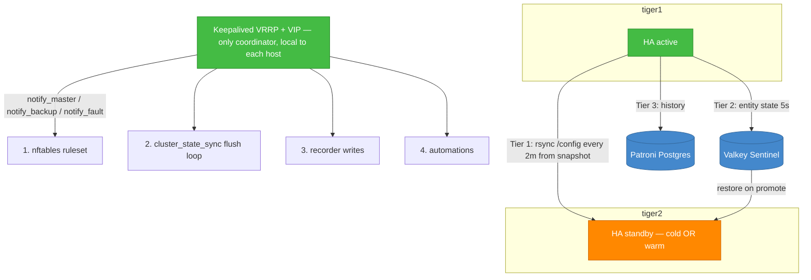

# ADR-001: Active-passive topology — selectable cold / warm standby with a built-in wizard

**Status:** Accepted — partially implemented
**Date:** 2026-05-27
**Last reviewed:** 2026-08-06

> **Implementation status:** the wizard (§4) and gating layer 2 are built; layers 1, 3 and 4 are not.
>
> **Cold-boot RTO — the acceptance test this ADR names as deciding cold vs warm — was MEASURED on
> the real pair on 2026-09-07, and cold PASSES.** Host loss simulated on node-a, timed by a
> recorder running on the standby:
>
> ```
> T0  host loss                 +0.0s
>     lease taken              +30.6s   (exactly the 30s TTL)
>     container running        +76.6s
>     HTTP 200 answering       +78.8s   <- NOT yet working
>     fully initialized        +102s    <- integrations and automations up
> ```
>
> **~102 s against the 150 s budget — 48 s of margin.**
>
> 🚨 **Measure to "initialized", not to HTTP 200.** The root path answers while the bootstrap is
> still running, so the first-response time understates the real RTO by ~23 s. The first published
> version of this measurement used 78.8 s and was measuring the wrong event. Cold standby stands as the recommended
> default; warm is not forced, and the firewall bundle's risks stay off the critical path.
>
> 🚨 **Two qualifications this ADR's original budget language did not carry, and now must:**
>
> 1. **That number is for host loss only.** A leader whose Home Assistant dies while the *host*
>    stays up keeps renewing its lease for the full `--probe-grace 600`, so that failure mode is
>    ~10.5 minutes by construction and **cannot** meet a 2.5-minute budget. Deliberate — D3 exists
>    to ride out restarts — but it is a property of the design, not an implementation gap.
> 2. **The promoted node had no radios.** See [ADR-009](./ADR-009-radio-custody-failure-modes.md).
>    An RTO to "HTTP 200" is not an RTO to "a working house" on any estate whose switches are RF.
>
> See the internal readiness assessment.
**Deciders:** mmanning (project owner)

## Context

`cluster_state_sync` exists to give two independent Home Assistant instances a 2.5-minute
active-passive failover (see [root README](../../README.md)). The README's original design uses a
Keepalived VIP, shared NFS for single-instance crypto integrations (HomeKit/Matter), and this
integration to mirror entity state through Valkey.

The v1 adversarial review (see the internal adversarial review)
and a subsequent design discussion exposed three things the original design left open:

1. **A standby is not inert.** Both nodes load the same integrations (config entries live in
   `.storage`, not `configuration.yaml`, so a stripped YAML does not disable them) and both fire
   automations during overlap. Both also connect to the same devices/clouds and — fatally — both
   run this integration's flush loop, where the snapshot-replace logic (finding **AR-0001**) means
   each node's flush wipes the other's snapshot (finding **AR-0017**, no leader election).
2. **Single-instance crypto identity** (HomeKit bridge, Matter fabric) must only be live on one
   node at a time; this is an identity problem, not just a traffic problem.
3. **There is no one "right" posture.** A *cold* standby (HA stopped until promotion) is simplest
   and safest with today's code but pays a cold-boot RTO; a *warm* standby (HA running, neutered)
   gives seconds-level failover but needs the side effects suppressed.

We want to support **either model**, chosen per deployment, and make the choice and its gnarly
host-side configuration **easy via a built-in wizard** rather than hand-rolled scripts.

We also want to avoid third-party clustering software (Pacemaker/Corosync/DRBD) and any third-party
firewall appliance: gating must run **locally on each Docker host**, driven by Keepalived.

## Decision

Adopt a **shared-nothing, three-tier-replication active-passive topology** in which **leadership is
the single source of truth**, expressed by Keepalived VRRP state on each host, and applied to every
gating layer by Keepalived `notify_*` scripts. Support **both** a Cold and a Warm standby model,
selectable through a built-in config-flow wizard.

> **Superseded in part (2026-09-01) by [ADR-006](./ADR-006-lease-promoter.md).** Keepalived was
> never installed on either host and now never will be: the VIP died when the ingress moved to
> `node-nas`, and the Valkey lease was already a better election than VRRP. The `notify_*` scripts
> survive unchanged — they are still how every gating layer is applied — but they are run by
> `cluster-promoter`, which reads the lease, rather than by VRRP state transitions.
>
> Everything else in this ADR stands. Leadership is still the single source of truth; only its
> transport changed.



### Three replication tiers (both models)

| Tier | What | Mechanism | Note |
|---|---|---|---|
| 1 — config / registries | `.storage`, YAML, auth | rsync active→standby every 2 min, **from a filesystem snapshot** | exclude recorder DB & volatile state; rsync direction flips with role |
| 2 — entity state | live states | `cluster_state_sync` → Valkey | restores on standby promotion |
| 3 — history | recorder DB | shared Patroni Postgres | never rsync a live SQLite DB |

> **Correction (2026-08-30). Tier 1 is retired; it never once ran.**
>
> The generated `cluster-config-sync` unit gated on `/run/cluster-sync/vrrp-state`
> saying `MASTER`, and **nothing on any install ever wrote that file.** The guard
> therefore always answered "not master", the rsync never executed, and its only
> symptom was a log line. Found by the whole-branch review of the fileset work,
> not by anything that was watching for it.
>
> Tier 1's job — replicating `.storage`, the YAML and the registries — is now done
> by fileset replication
> (design):
> encrypted end to end, preserving each node's own identity, and needing no root
> SSH trust between the hosts. The rsync is no longer generated in any
> configuration. Its filenames stay in `MANAGED_FILENAMES` so regeneration prunes
> them from an install that has an older bundle on disk.
>
> Removal was chosen over repair because nothing could be depending on a mechanism
> that had never run, and because bringing it to life on a **warm** pair would have
> rsynced `.storage` onto a live Home Assistant — handing the standby the leader's
> `node_id`, so both nodes renew the same lease and both believe they lead.

### The two supported models

| | **Cold standby** (default) | **Warm standby** |
|---|---|---|
| Standby HA process | stopped until promotion | running, neutered |
| Side-effect suppression | achieved by *not running* | nftables network gating + flush-loop gating + automation gating |
| Firewall needed? | no | yes |
| RTO | cold-boot time — **measured 2026-09-07: ~102s to initialised, host loss** (ADR-009 for the radio caveat) | seconds |
| Corruption-safe with today's code? | ✅ yes | ⚠️ only with the leader-lease/flush-gating in AR-0017 (interim: block follower's Redis) |
| Promotion action | start container → boot replicated config → restore from Valkey | swap nftables to leader set → settle → enable flush loop, recorder, automations |

### Leadership gating — the four layers, one trigger

On each host, Keepalived scripts flip all of these together:

- `notify_master`: become leader.
- `notify_backup` / `notify_fault`: become follower.

| # | Layer | Leader | Follower |
|---|---|---|---|
| 1 | nftables ruleset (warm only) | allow IoT subnets + cloud + mDNS/SSDP | drop IoT egress **and** multicast (mDNS 5353, SSDP 1900) |
| 2 | `cluster_state_sync` flush loop | on | off (interim: follower's Redis egress blocked so failed writes can't corrupt) |
| 3 | recorder writes | on | off, or DB egress blocked |
| 4 | automations | enabled | gated (leader flag) + settle window before enabling |

> **Split-brain guard:** VRRP alone can dual-master under a partition. The leader ruleset should be
> fully opened only when the node also holds the Valkey leader lease (AR-0017). Until that lands,
> blocking the follower's Redis access is the interim guard.

### Docker firewall — applied per container, per host (warm model)

The filter point depends on HA's Docker network mode. All rules are deployed identically to both
hosts (Ansible / baked image) and toggled by each host's *local* Keepalived — no central firewall.

- **`network_mode: host`** (common; best mDNS/HomeKit): filter on the host, matching HA's traffic by
  the **uid** it runs as, e.g. `nft add rule inet filter output meta skuid 1000 ip daddr <IoT> drop`
  and `... udp dport {5353,1900} drop`. `notify_master` runs `nft -f leader.nft`.
- **macvlan** (container gets its own LAN IP/MAC — device-like discovery + clean per-IP filter):
  filter the container's source IP; note macvlan egress can bypass the host `filter` hook — use the
  **netdev/egress** hook or the upstream switch.
- **bridge** (cleanest filter, weakest discovery): use Docker's **`DOCKER-USER`** chain (Docker won't
  clobber it), e.g. `iptables -I DOCKER-USER -s <container/subnet> -d <IoT> -j DROP`, removed by
  `notify_master`. Requires an mDNS reflector for HomeKit.

### Built-in wizard (new requirement — drives ease of use)

The integration's config flow becomes the single place to choose and configure the model. Goal:
**the operator answers a few questions; the integration generates the host-side gating bundle for
them** instead of hand-writing Keepalived/nftables. Steps:

1. **Backend** — Direct / Sentinel (existing).
2. **Topology model** — Cold standby (recommended) / Warm standby. One sentence each on the RTO vs
   complexity trade-off.
3. **Leadership signal** — how this node learns it is leader: (a) Keepalived state file path the
   integration watches, (b) an HA `input_boolean`/switch, or (c) Valkey leader lease (when AR-0017
   lands). The flush loop, recorder gating, and automation flag key off this one signal.
4. **Warm-only** — IoT subnet(s) (CIDR), block mDNS/SSDP (default yes), Docker network mode
   (host/macvlan/bridge), HA uid or container IP, promotion settle delay (default 15s).
5. **Generate bundle** — final step renders ready-to-install artifacts the operator copies to the
   host: `keepalived` `notify_master`/`notify_backup`/`notify_fault` scripts, `leader.nft` /
   `follower.nft` (warm), and the `rsync` unit + snapshot hook. Written to the config dir and shown
   on-screen. Cold model emits a smaller bundle (start/stop + restore, no firewall).

Wizard principles: **clear** (recommend Cold by default, label the RTO trade-off), **concise**
(≤5 steps, warm-only fields hidden unless Warm chosen), **easy** (generates the host config rather
than documenting it). The integration itself only governs what it can from inside the container
(layer 2/3/4 via the leadership signal); layer 1 (nftables) and process start/stop are emitted as
host scripts because the container is unprivileged.

## Alternatives Considered

| Option | Pros | Cons |
|---|---|---|
| **Cold-only** | Simplest; safe with today's code; no firewall | RTO may miss the 2.5-min budget on large configs |
| **Warm-only** | Seconds-level failover | Needs firewall + leader lease; more to get wrong; rejected as the *sole* option |
| **Support both (chosen)** | Fits any RTO budget; one mental model (leadership) | Two paths to document/test; wizard must hide the complexity |
| NFS shared storage (original README) | Single source of config | Shared-storage SPOF + split-brain; superseded by shared-nothing rsync (crypto-identity single-load still required) |
| Pacemaker/Corosync/DRBD | Battle-tested HA stack | Heavy third-party clustering; explicitly out of scope |
| Third-party firewall appliance | Central policy | Adds a dependency; we gate locally on each host instead |

## Consequences

### Positive
- Either RTO posture is available without re-architecting; the difference is wizard answers, not code paths.
- Leadership is defined once; every gating layer derives from it, eliminating the four-disconnected-gates failure mode.
- Shared-nothing + local gating removes the NFS SPOF and avoids third-party clustering/firewall dependencies.
- The wizard turns multi-step Keepalived/nftables/rsync setup into generated artifacts — the "easy to use" requirement.

### Negative
- Two models to document, test, and support.
- The warm model is only fully corruption-safe once the AR-0017 leader lease exists; until then it relies on the interim Redis-block guard.
- The integration cannot apply host nftables or start/stop HA itself (unprivileged container), so part of the bundle is operator-installed.

### Risks
- **Split-brain** if VRRP dual-masters — mitigated by gating the leader ruleset on the Valkey lease (AR-0017).
- **Torn rsync** of live `.storage`/SQLite → corruption — mitigated by snapshot-then-rsync and excluding the recorder DB.
- **Crypto-identity collision** (HomeKit/Matter) if both nodes ever transmit on one fabric — mitigated by single-load (cold: not running; warm: nftables blocks mDNS + the integration must not be configured to load them on the follower).
- ~~**Cold-boot RTO** unknown until measured~~ — **measured 2026-09-07 at ~102s to initialised (host loss), inside the 150s budget.** Cold stands. Remaining unknowns moved to ADR-009 (radios follow an HA-only failure ~10 min late) and the 600s probe grace (an HA-only failure cannot meet the budget by design).

## References

- Related ADRs — decisions this one deferred, since resolved:
  - [ADR-002](./ADR-002-snapshot-integrity.md) — how snapshot entries are authenticated
  - [ADR-003](./ADR-003-leadership-resolution.md) — **how a node learns it is leader**, which this ADR named but left open, and the answer to the split-brain risk below
  - [ADR-004](./ADR-004-snapshot-write-semantics.md) — the AR-0001 fix and the interim multi-writer guard
  - [ADR-005](./ADR-005-generate-not-control.md) — how the wizard's host bundle is delivered, and why the integration does not apply it itself
- Design templates: 06 (Infrastructure & Cloud), 02 (Backend), 26 (Disaster Recovery & BCP), 23 (Incident Response)
- Adversarial review: AR-0001 (delta-not-full-state), AR-0017 (no leader election), AR-0004 (location/alarm exposure) — see the internal adversarial review and the internal backlog
- Original design: [root README](../../README.md). The integration README
  carried a second copy until 2026-09-12, when it was reduced to a pointer;
  the original text is in git history.

## Implementation status of the four layers — 2026-08-26

| Layer | State |
|---|---|
| 1 — nftables ruleset | Generated, not applied by the integration ([ADR-005](./ADR-005-generate-not-control.md)). Warm only. |
| 2 — flush loop | **Built.** Gated on the leadership signal ([ADR-003](./ADR-003-leadership-resolution.md)). |
| 3 — recorder writes | **Built** — `gating.py`, via `recorder.disable` / `recorder.enable`. |
| 4 — automations | **Built** — `gating.py`, via `automation.turn_off` / `turn_on` across all entities. |

**Layers 3 and 4 are opt-in and default to off**, which is a deliberate
departure from simply reusing layer 2's signal.

`async_is_leader` fails closed: a backend it cannot reach answers *not leader*.
For the flush that is correct — declining to write costs one interval of
freshness, and assuming leadership is how two writers happen. For automations it
is not equivalent at all. A thirty-second Valkey blip would turn off every
automation in the house, and the mechanism intended to prevent a messy failover
would itself become the outage.

They also act only on a **transition**. Re-issuing `automation.turn_off` on the
flush cadence would fight anyone using the UI and fill the log with a change
that is not one. A call that fails is retried on the next pass rather than
recorded as done — a gate that believes it disabled something it did not is
worse than no gate, because it reports success while a follower keeps running
automations.

> **Layer 3 currently guards very little.** It exists for a shared recorder
> database, and tier 3's shared Patroni Postgres is not deployed — each node has
> its own SQLite, where a follower's writes are simply a separate history nobody
> reads. Built now so it is there the moment that changes, rather than
> discovered missing then.

## Amendment — 2026-08-27 (AR-0038)

Leadership signal option (b), *an HA `input_boolean`/switch*, carries a constraint this ADR did
not state and which the first implementation did not honour.

`input_boolean` is in the integration's default domain allowlist. So on the configuration this
ADR recommends, the leader mirrored its own leadership flag into the shared snapshot; the
standby restored it at boot — before its first leadership evaluation — read the flag as `on`,
and promoted itself while the peer was still live. Both nodes leaders, which is the condition
the whole of §"Leadership gating" exists to prevent.

**The signal is a statement about one node, so it is never cluster state.** The entity named as
the leadership signal is now excluded from the mirror and from the restore ahead of the
include/exclude precedence, so no configuration can re-enable it. Set it on each host
independently; the generated `notify_master.sh` says so.

This does not affect option (c), the Valkey lease, which never touches Home Assistant state.
It is a further reason to prefer it: the lease cannot be replicated by the thing it governs.

## Compliance Cross-References

- **SDLC Framework** Phase 1 §1.5 (ADRs for key decisions) and Phase 2 (Architecture Review Gate).
- Implements remediation direction for **AR-0017**; the wizard is tracked in the internal backlog (§4 Topology & wizard).
